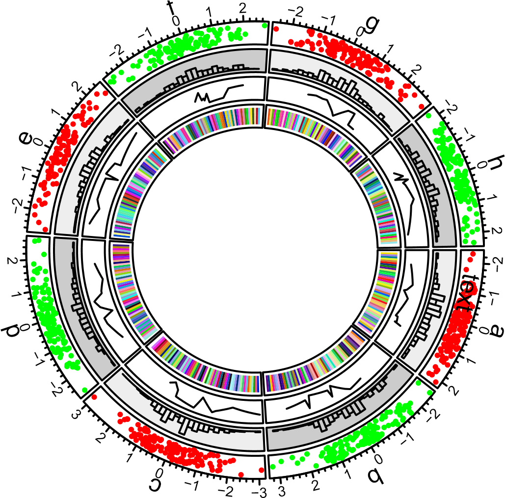

# Introduction
## A quick glance
```r
set.seed(999)
n = 1000
df = data.frame(sectors = sample(letters[1:8], n, replace = TRUE),
    x = rnorm(n), y = runif(n))
```

```r
library(circlizePlus)
par1=ccPar("track.height" = 0.1)
cc=ccPlot(sectors = df$sectors, x = df$x) + par1
```
```r
track1 = ccTrack(sectors = df$sectors, y = df$y,
    panel.fun = function(x, y) {
        circos.text(CELL_META$xcenter, 
            CELL_META$cell.ylim[2] + mm_y(5), 
            CELL_META$sector.index)
        circos.axis(labels.cex = 0.6)
})
col = rep(c("#FF0000", "#00FF00"), 4)
tackPoint1 = ccTrackPoints(sectors = df$sectors, x = df$x, y = df$y, col = col, pch = 16, cex = 0.5)
cell1 = ccCell(sector.index = 'a') + ccText(-1, 0.5, "text")
track1 = track1 + cell1 + tackPoint1
cc = cc + track1
cc
```

<div class="figure" style="text-align: center">

<p class="caption">First example of circlize, add the first track.</p>
</div>

```r
bgcol = rep(c("#EFEFEF", "#CCCCCC"), 4)
track2 = ccTrackHist(df$sectors, df$x, bin.size = 0.2, bg.col = bgcol, col = NA)
cc = cc + track2
cc
```

<div class="figure" style="text-align: center">

<p class="caption">First example of circlize, add the second track.</p>
</div>

```r
track3 = ccTrack(df$sectors, x = df$x, y = df$y,
    panel.fun = function(x, y) {
        ind = sample(length(x), 10)
        x2 = x[ind]
        y2 = y[ind]
        od = order(x2)
        circos.lines(x2[od], y2[od])
})
cc = cc + track3
cc
```

<div class="figure" style="text-align: center">

<p class="caption">First example of circlize, add the third track.</p>
</div>

```r
track4 = ccTrack(ylim = c(0, 1), panel.fun = function(x, y) {
    xlim = CELL_META$xlim
    ylim = CELL_META$ylim
    breaks = seq(xlim[1], xlim[2], by = 0.1)
    n_breaks = length(breaks)
    circos.rect(breaks[-n_breaks], rep(ylim[1], n_breaks - 1),
                breaks[-1], rep(ylim[2], n_breaks - 1),
                col = rand_color(n_breaks), border = NA)
})
cc = cc + track4
cc
```

<div class="figure" style="text-align: center">

<p class="caption">First example of circlize, add the fourth track.</p>
</div>

```r
link1 = ccLink("a", 0, "b", 0, h = 0.4)
link2 = ccLink("c", c(-0.5, 0.5), "d", c(-0.5,0.5), col = "red",
    border = "blue", h = 0.2)
link3 = ccLink("e", 0, "g", c(-1,1), col = "green", border = "black", lwd = 2, lty = 2)
cc = cc + link1 + link2 + link3
cc
```

<div class="figure" style="text-align: center">

<p class="caption">First example of circlize, add links.</p>
</div>

```r
circos.update(sector.index = "d", track.index = 2, 
    bg.col = "#FF8080", bg.border = "black")
circos.points(x = -2:2, y = rep(0.5, 5), col = "white")
circos.text(CELL_META$xcenter, CELL_META$ycenter, "updated", col = "white")
```

<div class="figure" style="text-align: center">

<p class="caption">First example of circlize, update the second track.</p>
</div>

```r
circos.clear()
```
