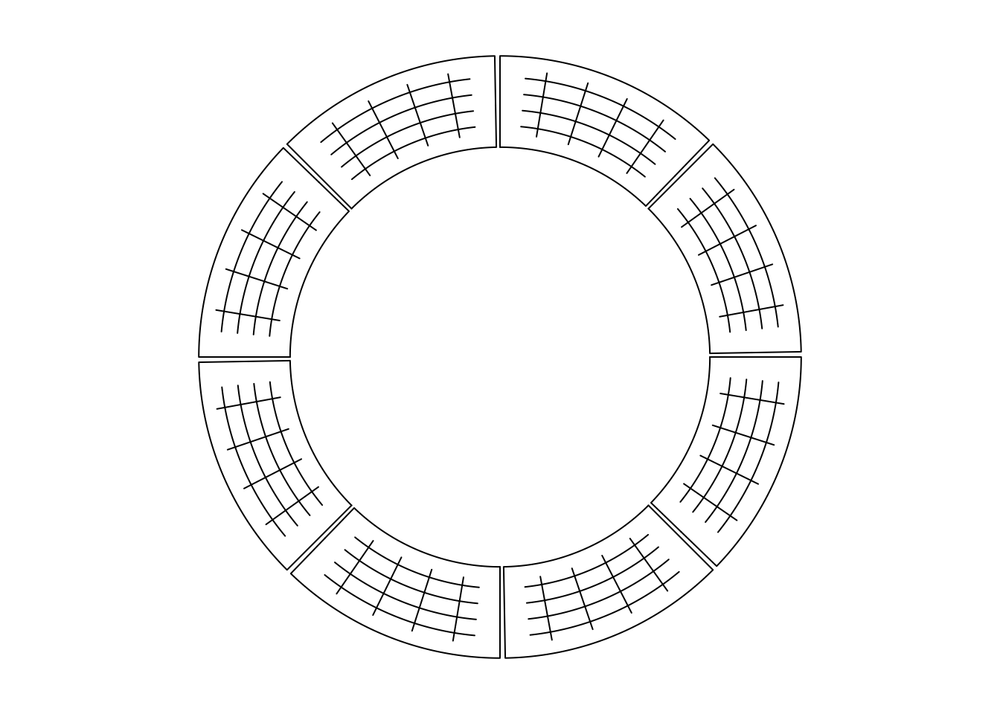
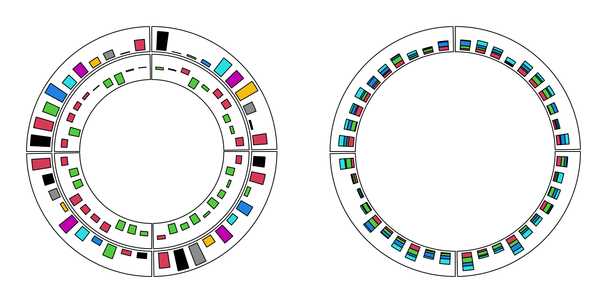
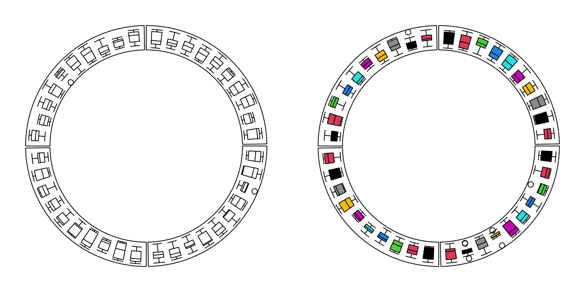
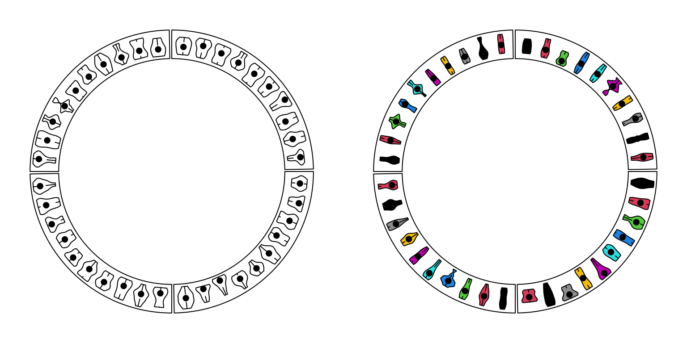
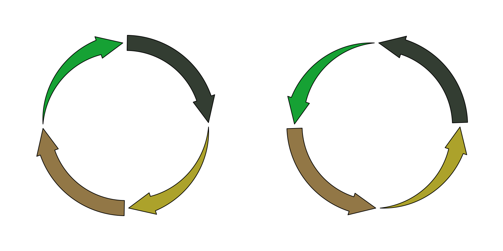
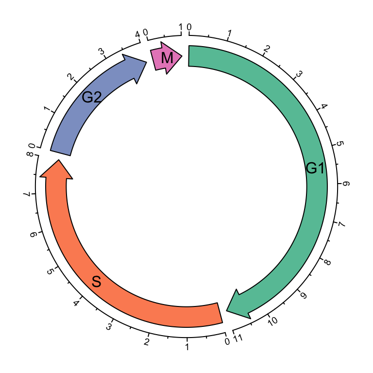
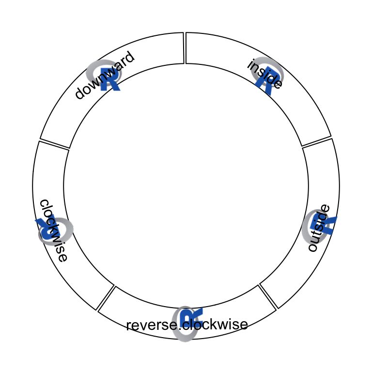
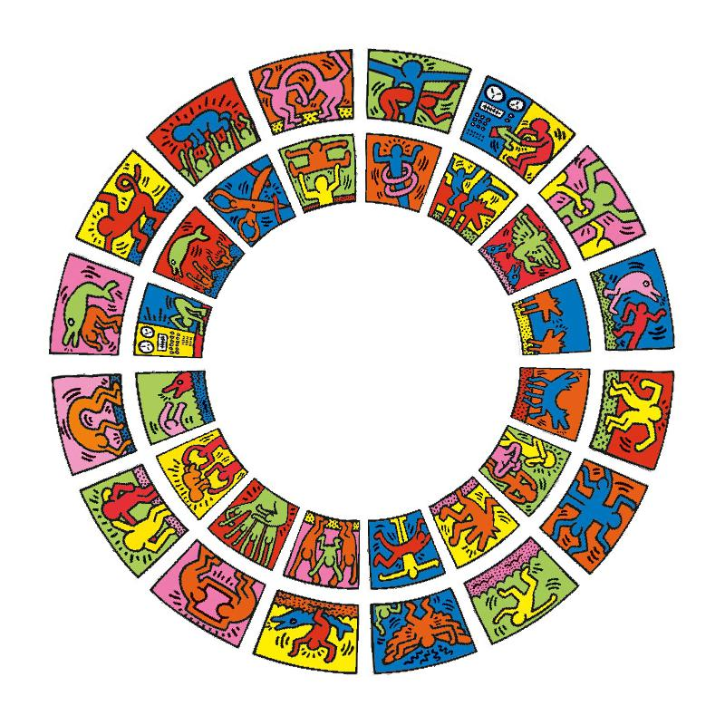
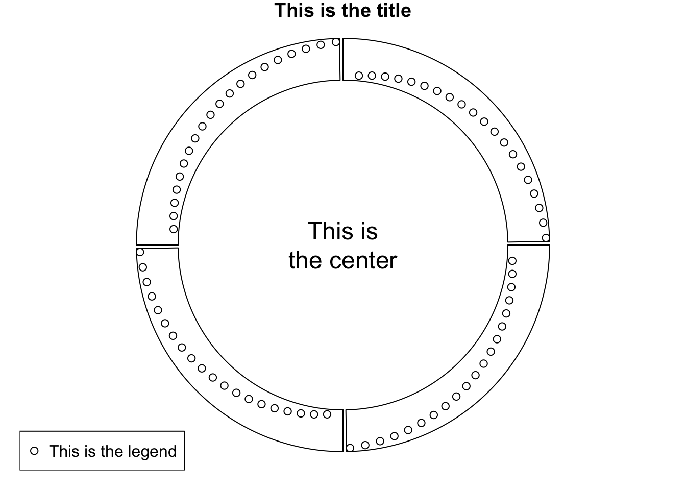

# Graphics

## Segments

```r
cc = ccPlot(sectors = letters[1:8], xlim = c(0, 1))
t1 = ccTrack(ylim = c(0, 1), track.height = 0.3, panel.fun = function(x, y) {
    x = seq(0.2, 0.8, by = 0.2)
    y = seq(0.2, 0.8, by = 0.2)

    circos.segments(x, 0.1, x, 0.9)
    circos.segments(0.1, y, 0.9, y)
})
cc + t1
```

<div class="figure" style="text-align: center">

<p class="caption">Draw segments.</p>
</div>

```r
circos.clear()
```

## Barplots, boxplots and violin plots

```r
par(mfrow = c(1, 2))
cc = ccPlot(sectors = letters[1:4], xlim = c(0, 10))
t1 = ccTrack(ylim = c(0, 1), panel.fun = function(x, y) {
    value = runif(10)
    circos.barplot(value, 1:10 - 0.5, col = 1:10)
})
t2 = ccTrack(ylim = c(-1, 1), panel.fun = function(x, y) {
    value = runif(10, min = -1, max = 1)
    circos.barplot(value, 1:10 - 0.5, col = ifelse(value > 0, 2, 3))
})
cc + t1 + t2

cc = ccPlot(sectors =letters[1:4], xlim = c(0, 10))
t1 = ccTrack(ylim = c(0, 4), panel.fun = function(x, y) {
    value = matrix(runif(10*4), ncol = 4)
    circos.barplot(value, 1:10 - 0.5, col = 2:5)
})
cc + t1
```

<div class="figure" style="text-align: center">

<p class="caption">Circular barplots.</p>
</div>

```r
circos.clear()
```

```r
par(mfrow = c(1, 2))
cc = ccPlot(sectors = letters[1:4], xlim = c(0, 10))
t1 = ccTrack(ylim = c(0, 1), panel.fun = function(x, y) {
    for(pos in seq(0.5, 9.5, by = 1)) {
        value = runif(10)
        circos.boxplot(value, pos)
    }
})
cc + t1

cc = ccPlot(sectors = letters[1:4], xlim = c(0, 10))
t1 = ccTrack(ylim = c(0, 1), panel.fun = function(x, y) {
    value = replicate(runif(10), n = 10, simplify = FALSE)
    circos.boxplot(value, 1:10 - 0.5, col = 1:10)
})
cc + t1
```

<div class="figure" style="text-align: center">

<p class="caption">Circular boxplots.</p>
</div>

```r
circos.clear()
```

```r
par(mfrow = c(1, 2))
cc = ccPlot(sectors = letters[1:4], xlim = c(0, 10))
t1 = ccTrack(ylim = c(0, 1), panel.fun = function(x, y) {
    for(pos in seq(0.5, 9.5, by = 1)) {
        value = runif(10)
        circos.violin(value, pos)
    }
})
cc + t1

cc = ccPlot(sectorsletters[1:4], xlim = c(0, 10))
t1 = ccTrack(ylim = c(0, 1), panel.fun = function(x, y) {
    value = replicate(runif(10), n = 10, simplify = FALSE)
    circos.violin(value, 1:10 - 0.5, col = 1:10)
})
cc + t1
```

<div class="figure" style="text-align: center">

<p class="caption">Circular violin plots.</p>
</div>

```r
circos.clear()
```

## Circular arrows

```r
par(mfrow = c(1, 2))
cc = ccPlot(sectors = letters[1:4], xlim = c(0, 1))
col = rand_color(4)
tail = c("point", "normal", "point", "normal")
t1 = ccTrack(ylim = c(0, 1), panel.fun = function(x, y) {
    circos.arrow(x1 = 0, x2 = 1, y = 0.5, width = 0.4, 
        arrow.head.width = 0.6, arrow.head.length = cm_x(1), 
        col = col[CELL_META$sector.numeric.index], 
        tail = tail[CELL_META$sector.numeric.index])
}, bg.border = NA, track.height = 0.4)
cc + t1
cc = ccPlot(sectors = letters[1:4], xlim = c(0, 1))
tail = c("point", "normal", "point", "normal")
t1 = ccTrack(ylim = c(0, 1), panel.fun = function(x, y) {
    circos.arrow(x1 = 0, x2 = 1, y = 0.5, width = 0.4, 
        arrow.head.width = 0.6, arrow.head.length = cm_x(1), 
        col = col[CELL_META$sector.numeric.index], 
        tail = tail[CELL_META$sector.numeric.index],
        arrow.position = "start")
}, bg.border = NA, track.height = 0.4)
cc + t1
```

<div class="figure" style="text-align: center">

<p class="caption">Circular arrows.</p>
</div>

```r
cell_cycle = data.frame(phase = factor(c("G1", "S", "G2", "M"), levels = c("G1", "S", "G2", "M")),
                        hour = c(11, 8, 4, 1))
color = c("#66C2A5", "#FC8D62", "#8DA0CB", "#E78AC3")
ccp = ccPar(start.degree = 90)
cc = ccPlot(sectors = cell_cycle$phase, xlim = cbind(rep(0, 4), cell_cycle$hour))
t1 = ccTrack(ylim = c(0, 1), panel.fun = function(x, y) {
    circos.arrow(CELL_META$xlim[1], CELL_META$xlim[2], 
        arrow.head.width = CELL_META$yrange*0.8, arrow.head.length = cm_x(0.5),
        col = color[CELL_META$sector.numeric.index])
    circos.text(CELL_META$xcenter, CELL_META$ycenter, CELL_META$sector.index, 
        facing = "downward")
    circos.axis(h = 1, major.at = seq(0, round(CELL_META$xlim[2])), minor.ticks = 1,
        labels.cex = 0.6)
}, bg.border = NA, track.height = 0.3)
cc + ccp + t1
```

<div class="figure" style="text-align: center">

<p class="caption">Cell cycle.</p>
</div>

```r
circos.clear()
```

## Raster image

```r
library(png)
image = system.file("extdata", "Rlogo.png", package = "circlize")
image = as.raster(readPNG(image))
ccp = ccPar(start.degree = 90)
cc = ccPlot(sectors = letters[1:5], xlim = c(0, 1))
all_facing_options = c("inside", "outside", "reverse.clockwise", "clockwise", "downward")
t1 = ccTrack(ylim = c(0, 1), panel.fun = function(x, y) {
    circos.raster(image, CELL_META$xcenter, CELL_META$ycenter, width = "1cm", 
        facing = all_facing_options[CELL_META$sector.numeric.index])
    circos.text(CELL_META$xcenter, CELL_META$ycenter, 
        all_facing_options[CELL_META$sector.numeric.index],
        facing = "inside", niceFacing = TRUE)
})
cc + ccp + t1
```

<div class="figure" style="text-align: center">

<p class="caption">Five facings of raster image.</p>
</div>

```r
load(system.file("extdata", "doodle.RData", package = "circlize"))
ccp = ccPar("cell.padding" = c(0, 0, 0, 0))
cc = ccPlot(sectors = letters[1:16], xlim = c(0, 1))
t1 =ccTrack(ylim = c(0, 1), panel.fun = function(x, y) {
    img = img_list[[CELL_META$sector.numeric.index]]
    circos.raster(img, CELL_META$xcenter, CELL_META$ycenter, 
        width = CELL_META$xrange, height = CELL_META$yrange, 
        facing = "bending.inside")
}, track.height = 0.25, bg.border = NA)
t2 = ccTrack(ylim = c(0, 1), panel.fun = function(x, y) {
    img = img_list[[CELL_META$sector.numeric.index + 16]]
    circos.raster(img, CELL_META$xcenter, CELL_META$ycenter, 
        width = CELL_META$xrange, height = CELL_META$yrange, 
        facing = "bending.inside")
}, track.height = 0.25, bg.border = NA)
cc + ccp + t1 + t2
```

<div class="figure" style="text-align: center">

<p class="caption">Fill raster image to the cell.</p>
</div>

## Work together with the base graphic system

```r
sectors = letters[1:4]
cc = ccPlot(sectors = sectors, xlim = c(0, 1))
t1 = ccTrack(ylim = c(0, 1), panel.fun = function(x, y) {
    circos.points(1:20/20, 1:20/20)
})
cc + t1
text(0, 0, "This is\nthe center", cex = 1.5)
legend("bottomleft", pch = 1, legend = "This is the legend")
title("This is the title")
```

<div class="figure" style="text-align: center">

<p class="caption">Work with base graphic functions.</p>
</div>

```r
circos.clear()
```
