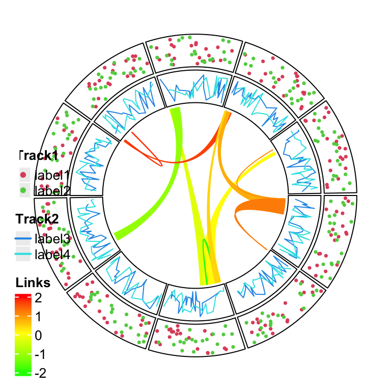
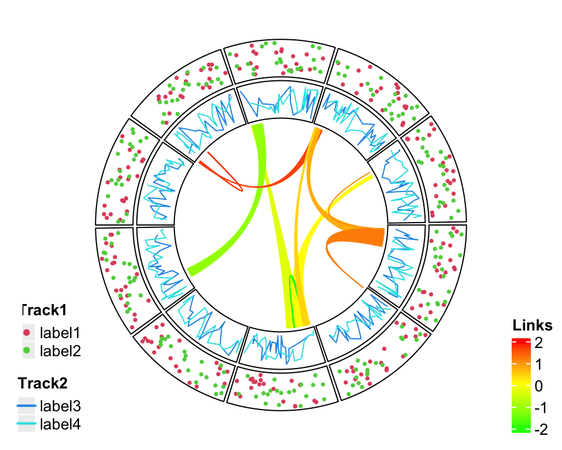
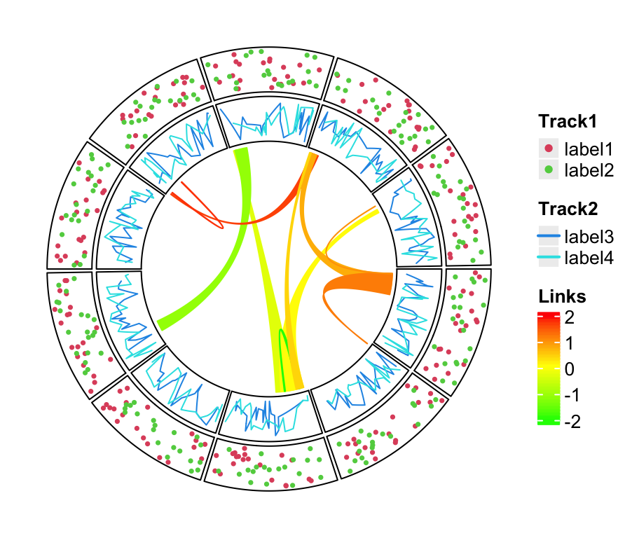
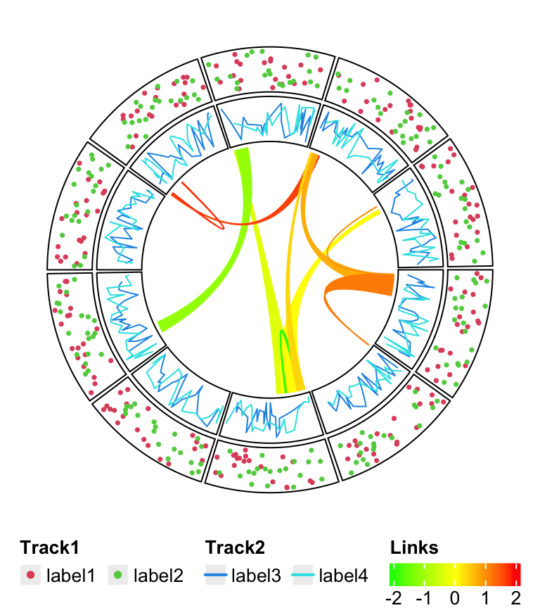

# Legends

```r
col_fun = colorRamp2(c(-2, 0, 2), c("green", "yellow", "red"))
circlize_plot = function() {
    set.seed(12345)
    sectors = letters[1:10]
    cc = ccPlot(sectors = sectors, xlim = c(0, 1))
    t1 = ccTrack(ylim = c(0, 1), panel.fun = function(x, y) {
        circos.points(runif(20), runif(20), cex = 0.5, pch = 16, col = 2)
        circos.points(runif(20), runif(20), cex = 0.5, pch = 16, col = 3)
    })
    t2 = ccTrack(ylim = c(0, 1), panel.fun = function(x, y) {
        circos.lines(sort(runif(20)), runif(20), col = 4)
        circos.lines(sort(runif(20)), runif(20), col = 5)
    })
    cc = cc + t1 + t2
    for(i in 1:10) {
        l = ccLink(sample(sectors, 1), sort(runif(10))[1:2], 
                    sample(sectors, 1), sort(runif(10))[1:2],
                    col = add_transparency(col_fun(rnorm(1))))
        cc = cc + l
    }
    cc
}
```

```r
library(ComplexHeatmap)
# discrete
lgd_points = Legend(at = c("label1", "label2"), type = "points", 
    legend_gp = gpar(col = 2:3), title_position = "topleft", 
    title = "Track1")
# discrete
lgd_lines = Legend(at = c("label3", "label4"), type = "lines", 
    legend_gp = gpar(col = 4:5, lwd = 2), title_position = "topleft", 
    title = "Track2")
# continuous
lgd_links = Legend(at = c(-2, -1, 0, 1, 2), col_fun = col_fun, 
    title_position = "topleft", title = "Links")

lgd_list_vertical = packLegend(lgd_points, lgd_lines, lgd_links)
lgd_list_vertical
```

```r
circlize_plot()
# next the grid graphics are added directly to the plot
# where circlize has created.
draw(lgd_list_vertical, x = unit(4, "mm"), y = unit(4, "mm"), just = c("left", "bottom"))
```

<div class="figure" style="text-align: center">

<p class="caption">Directly add grid graphics.</p>
</div>

```r
lgd_list_vertical2 = packLegend(lgd_points, lgd_lines)
circlize_plot()
# next the grid graphics are added directly to the plot
# where circlize has created.
draw(lgd_list_vertical2, x = unit(4, "mm"), y = unit(4, "mm"), just = c("left", "bottom"))
draw(lgd_links, x = unit(1, "npc") - unit(2, "mm"), y = unit(4, "mm"), 
    just = c("right", "bottom"))
```

<div class="figure" style="text-align: center">

<p class="caption">Split into two legends.</p>
</div>

```r
library(gridBase)
plot.new()
circle_size = unit(1, "snpc") # snpc unit gives you a square region

pushViewport(viewport(x = 0, y = 0.5, width = circle_size, height = circle_size,
    just = c("left", "center")))
par(omi = gridOMI(), new = TRUE)
circlize_plot()
upViewport()

draw(lgd_list_vertical, x = circle_size, just = "left")
```



```r
lgd_points = Legend(at = c("label1", "label2"), type = "points", 
    legend_gp = gpar(col = 2:3), title_position = "topleft", 
    title = "Track1", nrow = 1)

lgd_lines = Legend(at = c("label3", "label4"), type = "lines", 
    legend_gp = gpar(col = 4:5, lwd = 2), title_position = "topleft", 
    title = "Track2", nrow = 1)

lgd_links = Legend(at = c(-2, -1, 0, 1, 2), col_fun = col_fun, 
    title_position = "topleft", title = "Links", direction = "horizontal")

lgd_list_horizontal = packLegend(lgd_points, lgd_lines, lgd_links, 
    direction = "horizontal")
```

Similar code to arrange viewports.


```r
plot.new()
pushViewport(viewport(x = 0.5, y = 1, width = circle_size, height = circle_size,
    just = c("center", "top")))
par(omi = gridOMI(), new = TRUE)
circlize_plot()
upViewport()

draw(lgd_list_horizontal, y = unit(1, "npc") - circle_size, just = "bottom")
```



