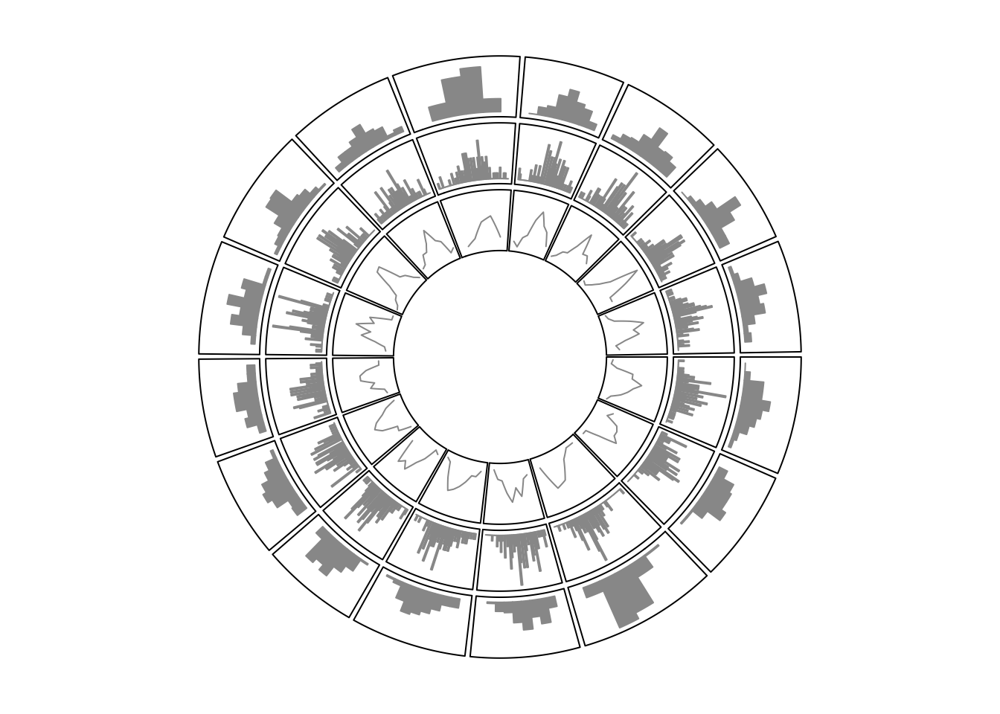

# Implement high-level circular plots

## Circular barplots

```r
category = paste0("category", "_", 1:9)
percent = sort(sample(40:80, 9))
color = rev(rainbow(length(percent)))

par1 = ccPar("start.degree" = 90, cell.padding = c(0, 0, 0, 0))
cc = ccPlot(sectors = "a", xlim = c(0, 100)) # 'a` just means there is one sector
t1 = ccTrack(ylim = c(0.5, length(percent)+0.5), track.height = 0.8, 
    bg.border = NA, panel.fun = function(x, y) {
        xlim = CELL_META$xlim
        circos.segments(rep(xlim[1], 9), 1:9,
                        rep(xlim[2], 9), 1:9,
                        col = "#CCCCCC")
        circos.rect(rep(0, 9), 1:9 - 0.45, percent, 1:9 + 0.45,
            col = color, border = "white")
        circos.text(rep(xlim[1], 9), 1:9, 
            paste(category, " - ", percent, "%"), 
            facing = "downward", adj = c(1.05, 0.5), cex = 0.8) 
        breaks = seq(0, 85, by = 5)
        circos.axis(h = "top", major.at = breaks, labels = paste0(breaks, "%"), 
            labels.cex = 0.6)
})
cc + par1 + t1
```

<div class="figure" style="text-align: center">

<p class="caption">A circular barplot.</p>
</div>

```r
circos.clear()
```

## Histograms

```r
x = rnorm(1600)
sectors = sample(letters[1:16], 1600, replace = TRUE)
cc = ccPlot(sectors = sectors, x = x)
t1 = ccTrackHist(sectors, x = x, col = "#999999", 
    border = "#999999")
t2 = ccTrackHist(sectors, x = x, bin.size = 0.1, 
    col = "#999999", border = "#999999")
t3 = ccTrackHist(sectors, x = x, draw.density = TRUE, 
    col = "#999999", border = "#999999")
cc + t1 + t2 + t3
```

<div class="figure" style="text-align: center">

<p class="caption">Histograms on circular layout.</p>
</div>

```r
circos.clear()
```

## Phylogenetic trees

```r
library(ape)
data(bird.orders)
hc = as.hclust(bird.orders)
```

```r
labels = hc$labels  # name of birds
ct = cutree(hc, 6)  # cut tree into 6 pieces
n = length(labels)  # number of bird species
dend = as.dendrogram(hc)
```

```r
par1 = ccPar(cell.padding = c(0, 0, 0, 0))
cc = ccPlot(sectors = "a", xlim = c(0, n)) # only one sector
t1 = ccTrack(ylim = c(0, 1), bg.border = NA, track.height = 0.3, 
    panel.fun = function(x, y) {
        for(i in seq_len(n)) {
            circos.text(i-0.5, 0, labels[i], adj = c(0, 0.5), 
                facing = "clockwise", niceFacing = TRUE,
                col = ct[labels[i]], cex = 0.5)
        }
})
```

```r
suppressPackageStartupMessages(library(dendextend))
dend = color_branches(dend, k = 6, col = 1:6)
dend_height = attr(dend, "height")
t2 = ccTrack(ylim = c(0, dend_height), bg.border = NA, 
    track.height = 0.4, panel.fun = function(x, y) {
        circos.dendrogram(dend)
})
cc + par1 + t1 + t2
```

```r
t2 = ccTrack(ylim = c(0, dend_height), bg.border = NA, 
    track.height = 0.4, panel.fun = function(x, y) {
        circos.dendrogram(dend, facing = "inside")
})
cc + par1 + t2 + t1
```


<div class="figure" style="text-align: center">

<p class="caption">A circular phylogenetic tree.</p>
</div>

## Manually create heatmaps

```r
mat = matrix(rnorm(100*10), nrow = 100, ncol = 10)
col_fun = colorRamp2(c(-2, 0, 2), c("green", "black", "red"))
sectors = rep(letters[1:2], times = c(30, 70))
mat_list = list(a = mat[sectors == "a", ],
                b = mat[sectors == "b", ])
dend_list = list(a = as.dendrogram(hclust(dist(mat_list[["a"]]))),
                 b = as.dendrogram(hclust(dist(mat_list[["b"]]))))
```

```r
par1 = ccPar(cell.padding = c(0, 0, 0, 0), gap.degree = 5)
cc = ccPlot(sectors = sectors, xlim = cbind(c(0, 0), table(sectors)))
t1 = ccTrack(ylim = c(0, 10), bg.border = NA, panel.fun = function(x, y) {
    sector.index = CELL_META$sector.index
    m = mat_list[[sector.index]]
    dend = dend_list[[sector.index]]

    m2 = m[order.dendrogram(dend), ]
    col_mat = col_fun(m2)
    nr = nrow(m2)
    nc = ncol(m2)
    for(i in 1:nc) {
        circos.rect(1:nr - 1, rep(nc - i, nr), 
            1:nr, rep(nc - i + 1, nr), 
            border = col_mat[, i], col = col_mat[, i])
    }
})
```

```r
max_height = max(sapply(dend_list, function(x) attr(x, "height")))
t2 = ccTrack(ylim = c(0, max_height), bg.border = NA, track.height = 0.3, 
    panel.fun = function(x, y) {
        sector.index = get.cell.meta.data("sector.index")
        dend = dend_list[[sector.index]]
        circos.dendrogram(dend, max_height = max_height)
})
cc + par1 + t1 + t2
circos.clear()
```

<div class="figure" style="text-align: center">

<p class="caption">Circular heatmaps.</p>
</div>
