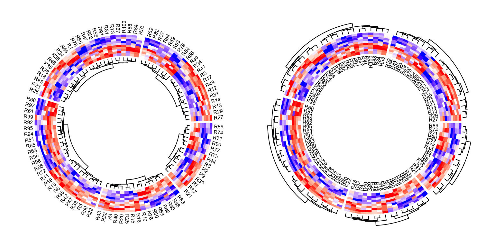
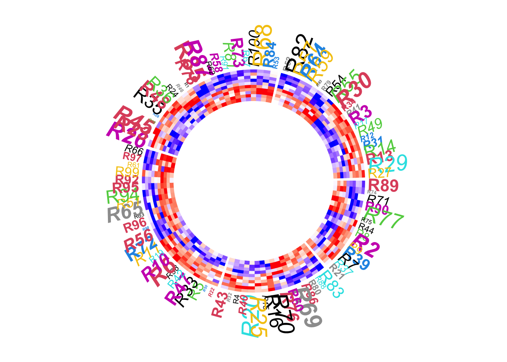
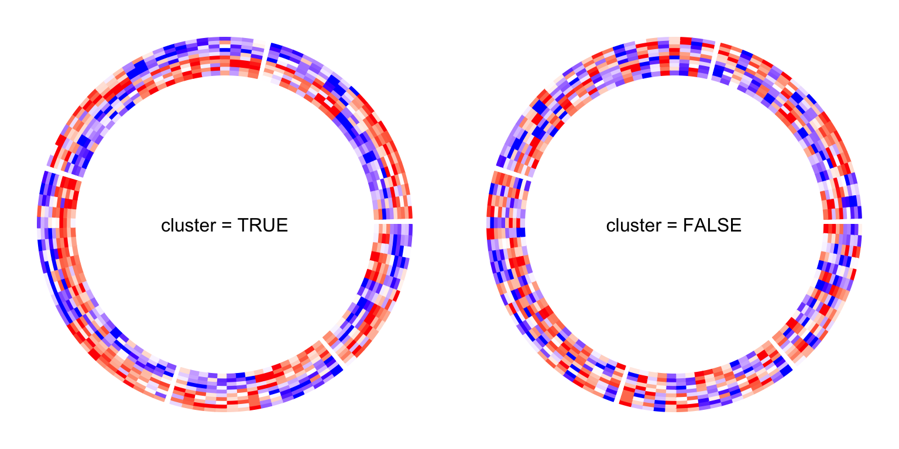
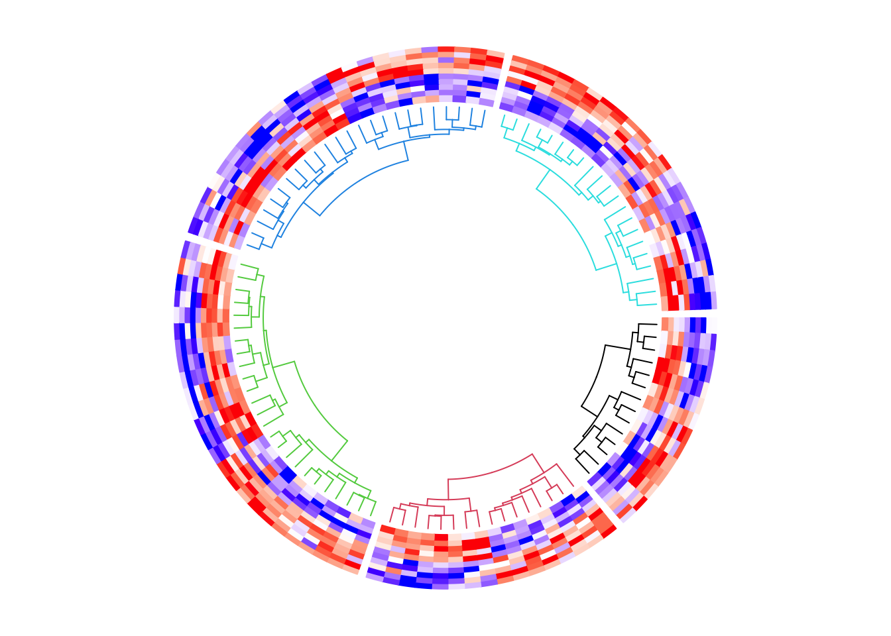
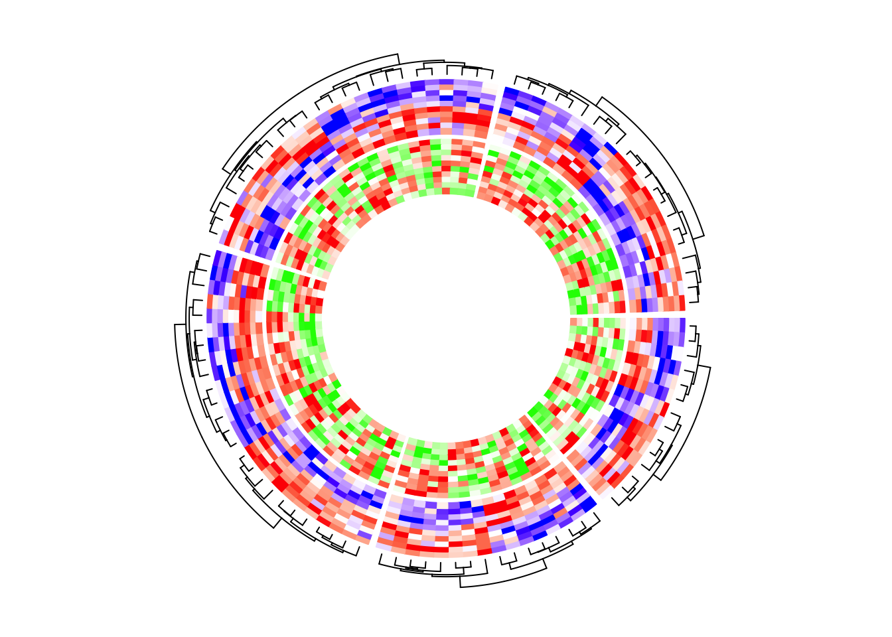
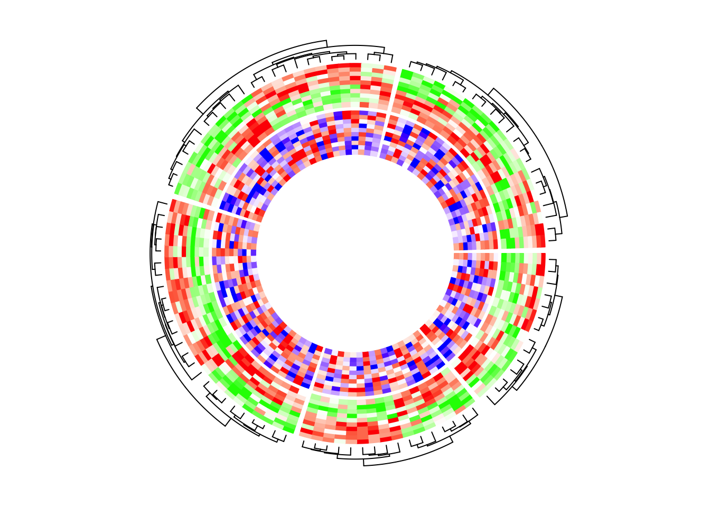
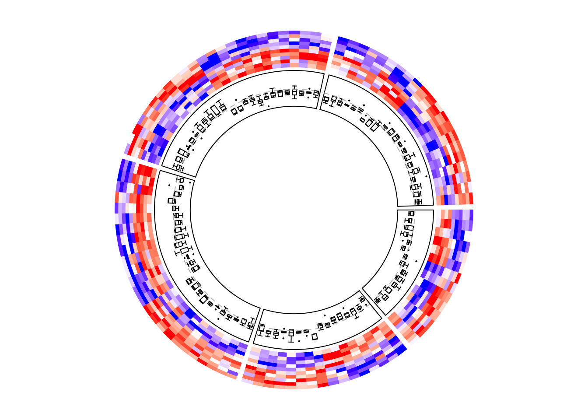
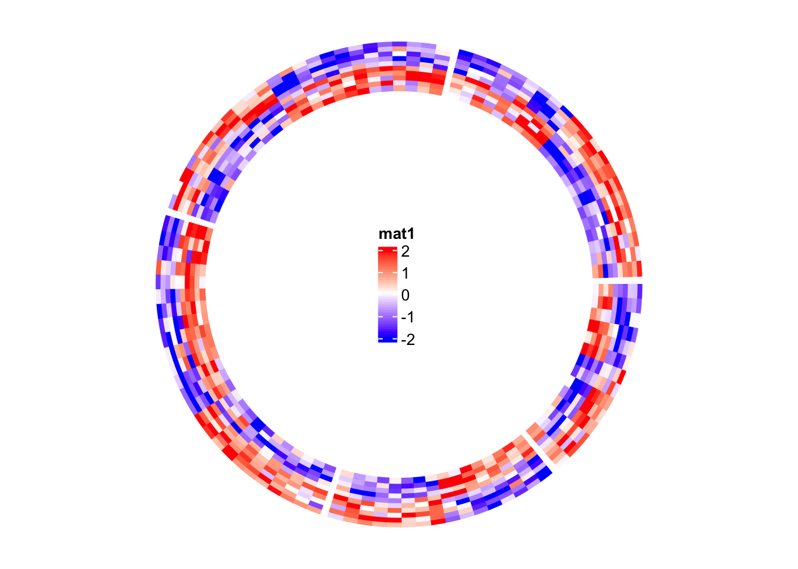
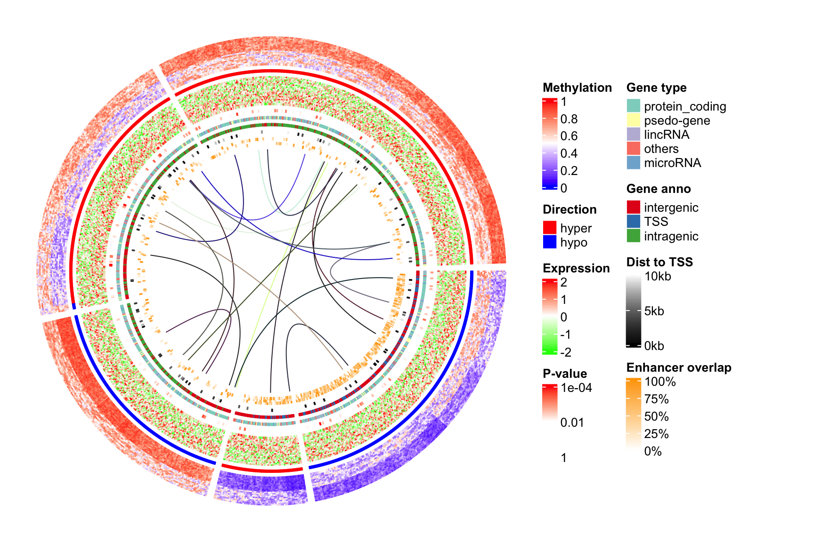

# The `circos.heatmap()` function 

```r
set.seed(123)
mat1 = rbind(cbind(matrix(rnorm(50*5, mean = 1), nr = 50), 
                   matrix(rnorm(50*5, mean = -1), nr = 50)),
             cbind(matrix(rnorm(50*5, mean = -1), nr = 50), 
                   matrix(rnorm(50*5, mean = 1), nr = 50))
            )
rownames(mat1) = paste0("R", 1:100)
colnames(mat1) = paste0("C", 1:10)
mat1 = mat1[sample(100, 100), ] # randomly permute rows
split = sample(letters[1:5], 100, replace = TRUE)
split = factor(split, levels = letters[1:5])
```
```r
library(ComplexHeatmap)
Heatmap(mat1, row_split = split)
```

<div class="figure" style="text-align: center">

<p class="caption">A normal heatmap.</p>
</div>

## Input data 

```r
library(circlize) # >= 0.4.10
col_fun1 = colorRamp2(c(-2, 0, 2), c("blue", "white", "red"))
ccHeatmap(mat = mat1, split = split, col = col_fun1)
```

<div class="figure" style="text-align: center">

<p class="caption">A circular heatmap which has been split.</p>
</div>

```r
circos.clear()
```

```r
ccHeatmap(mat = mat1, col = col_fun1)
```

<div class="figure" style="text-align: center">

<p class="caption">A circular heatmap which no split.</p>
</div>

```r
circos.clear()
```

## Circular layout

```r
par1 = ccPar(start.degree = 90, gap.degree = 10)
cc = ccHeatmap(mat = mat1, split = split, col = col_fun1, track.height = 0.4, bg.border = "green", bg.lwd = 2, bg.lty = 2, show.sector.labels = TRUE)
cc + par1
```

<div class="figure" style="text-align: center">

<p class="caption">Circular heatmap. Control the layout.</p>
</div>

```r
circos.clear()
```

```r
# note since circos.clear() was called in the previous plot,
# now the layout starts from theta = 0 (the first sector is 'e')
ccHeatmap(mat = mat1, split = factor(split, levels = c("e", "d", "c", "b", "a")), 
    col = col_fun1, show.sector.labels = TRUE)
```

<div class="figure" style="text-align: center">

<p class="caption">Circular heatmap. Control the order of heatmaps.</p>
</div>

```r
circos.clear()
```

## Dendrograms and row names


```r
ccHeatmap(mat = mat1, split = split, col = col_fun1, dend.side = "inside")
circos.clear()
ccHeatmap(mat = mat1, split = split, col = col_fun1, dend.side = "outside")
circos.clear()
```

<div class="figure" style="text-align: center">

<p class="caption">Circular heatmap. Control the dendrograms.</p>
</div>

```r
ccHeatmap(mat = mat1, split = split, col = col_fun1, rownames.side = "inside")
circos.clear()
text(0, 0, 'rownames.side = "inside"')
ccHeatmap(mat = mat1, split = split, col = col_fun1, rownames.side = "outside")
circos.clear()
text(0, 0, 'rownames.side = "outside"')
```

<div class="figure" style="text-align: center">

<p class="caption">Circular heatmap. Control the row names.</p>
</div>

```r
ccHeatmap(mat = mat1, split = split, col = col_fun1, dend.side = "inside", 
    rownames.side = "outside")
circos.clear()
ccHeatmap(mat = mat1, split = split, col = col_fun1, dend.side = "outside", 
    rownames.side = "inside")
circos.clear()
```

<div class="figure" style="text-align: center">

<p class="caption">Circular heatmap. Control both the dendrograms and row names.</p>
</div>

```r
ccHeatmap(mat = mat1, split = split, col = col_fun1, rownames.side = "outside",
    rownames.col = 1:nrow(mat1) %% 10 + 1,
    rownames.cex = runif(nrow(mat1), min = 0.3, max = 2),
    rownames.font = 1:nrow(mat1) %% 4 + 1)
```

<div class="figure" style="text-align: center">

<p class="caption">Circular heatmap. Control graphic parameters for row names.</p>
</div>

```r
circos.clear()
```

## Clustering

```r
ccHeatmap(mat = mat1, split = split, cluster = FALSE, col = col_fun1)
circos.clear()
```

<div class="figure" style="text-align: center">

<p class="caption">Circular heatmap. Control clusterings.</p>
</div>

## Callback on dendrograms

```r
function(dend, m, si) reorder(dend, rowMeans(m))
```

```r
library(dendsort)
ccHeatmap(mat = mat1, split = split, col = col_fun1, dend.side = "inside",
    dend.callback = function(dend, m, si) {
        dendsort(dend)
    }
)
circos.clear()
```

<div class="figure" style="text-align: center">

<p class="caption">Circular Heatmap. Reorder dendrograms.</p>
</div>

```r
library(dendextend)
dend_col = structure(1:5, names = letters[1:5])
ccHeatmap(mat = mat1, split = split, col = col_fun1, dend.side = "inside",
    dend.track.height = 0.2,
    dend.callback = function(dend, m, si) {
        # when k = 1, it renders one same color for the whole dendrogram
        color_branches(dend, k = 1, col = dend_col[si])
    }
)
```

<div class="figure" style="text-align: center">

<p class="caption">Circular heatmap. Render dendrograms that were split.</p>
</div>

```r
circos.clear()
```

```r
ccHeatmap(mat = mat1, col = col_fun1, dend.side = "inside",
    dend.track.height = 0.2,
    dend.callback = function(dend, m, si) {
        color_branches(dend, k = 4, col = 2:5)
    }
)
```

<div class="figure" style="text-align: center">

<p class="caption">Circular heatmap. Render dendrograms.</p>
</div>

```r
circos.clear()
```

## Multiple heatmap tracks

```r
mat2 = mat1[sample(100, 100), ] # randomly permute mat1 by rows
col_fun2 = colorRamp2(c(-2, 0, 2), c("green", "white", "red"))

hm1 = ccHeatmap(mat = mat1, split = split, col = col_fun1, dend.side = "outside")
hm2 = ccHeatmap(mat = mat2, col = col_fun2)
hm1 + hm2
```



```r
circos.clear()
```

```r
hm1 = ccHeatmap(mat = mat2, split = split, col = col_fun2, dend.side = "outside")
hm2 = ccHatmap(mat = mat1, col = col_fun1)
hm1 + hm2
```



```r
circos.clear()
```

```r
cc = ccPlot(initFunc='heatmap.initialize', mat = mat1, split = split)
hm1 = ccHeatmap(mat = mat2, col = col_fun2, dend.side = "outside")
hm2 = ccHeatmap(mat = mat1, col = col_fun1)
cc + hm1 + hm2
```


```r
circos.clear()
```

```r
cc = ccPlot(initFunc='heatmap.initialize', mat = mat1, split = split)
hm1 = ccHeatmap(mat = mat1[, 1:5], col = col_fun1)
hm2 = ccHeatmap(mat = mat1[, 6:10], col = col_fun1)
cc + hm1 + hm2
```


```r
circos.clear()
```

## With other tracks

```
CELL_META$row_dend
## 'dendrogram' with 2 branches and 14 members total, at height 10.51736 

CELL_META$row_order
## [1]  2  6  4 12  8  1  5 10  7  9 13 11  3 14

CELL_META$subset
## [1]  8  9 14 18 20 37 55 62 66 72 78 85 93 97
```

```r
hm1 = ccHeatmap(mat = mat1, split = split, col = col_fun1)
row_mean = rowMeans(mat1[, 1:5])
t1 = ccTrack(ylim = range(row_mean), panel.fun = function(x, y) {
    y = row_mean[CELL_META$subset]
    y = y[CELL_META$row_order]
    circos.lines(CELL_META$cell.xlim, c(0, 0), lty = 2, col = "grey")
    circos.points(seq_along(y) - 0.5, y, col = ifelse(y > 0, "red", "blue"))
}, cell.padding = c(0.02, 0, 0.02, 0))
hm1 + t1
```


```r
circos.clear()
```

```r
cc = ccPlot(initFunc='heatmap.initialize', mat = mat1, split = split)
# This is the same as the previous example
t1 = ccTrack(ylim = range(row_mean), panel.fun = function(x, y) {
    y = row_mean[CELL_META$subset]
    y = y[CELL_META$row_order]
    circos.lines(CELL_META$cell.xlim, c(0, 0), lty = 2, col = "grey")
    circos.points(seq_along(y) - 0.5, y, col = ifelse(y > 0, "red", "blue"))
}, cell.padding = c(0.02, 0, 0.02, 0))
hm1 = ccHeatmap(mat1, col = col_fun1) # no need to specify 'split' here
cc + t1 + hm1
```


```r
circos.clear()
```


```r
hm1 = ccHeatmap(mat = mat1, split = split, col = col_fun1)
t1 = ccTrack(ylim = range(mat1), panel.fun = function(x, y) {
    m = mat1[CELL_META$subset, 1:5, drop = FALSE]
    m = m[CELL_META$row_order, , drop = FALSE]
    n = nrow(m)
    # circos.boxplot is applied on matrix columns, so here we transpose it.
    circos.boxplot(t(m), pos = 1:n - 0.5, pch = 16, cex = 0.3)
    circos.lines(CELL_META$cell.xlim, c(0, 0), lty = 2, col = "grey")
}, cell.padding = c(0.02, 0, 0.02, 0))
hm1 + t1
```



```r
circos.clear()
```

## Add annotations

```r
hm1 = ccHeatmap(mat = mat1, split = split, col = col_fun1)
hm1
circos.track(track.index = get.current.track.index(), panel.fun = function(x, y) {
    circos.text(CELL_META$xcenter, CELL_META$cell.ylim[2] + convert_y(2, "mm"), 
        paste0("this is group ", CELL_META$sector.index),
        facing = "bending.inside", cex = 0.8,
        adj = c(0.5, 0), niceFacing = TRUE)
}, bg.border = NA)
```


```r
circos.clear()
```

```r
par1 = ccPar(gap.after = c(2, 2, 2, 2, 10))
hm1 = ccHeatmap(mat = mat1, split = split, col = col_fun1, track.height = 0.4)
hm1 + par1
circos.track(track.index = get.current.track.index(), panel.fun = function(x, y) {
    if(CELL_META$sector.numeric.index == 5) { # the last sector
        cn = colnames(mat1)
        n = length(cn)
        circos.text(rep(CELL_META$cell.xlim[2], n) + convert_x(1, "mm"), 
            1:n - 0.5, cn, 
            cex = 0.5, adj = c(0, 0.5), facing = "inside")
    }
}, bg.border = NA)
```


```r
circos.clear()
```

```r
par1 = ccPar(gap.after = c(2, 2, 2, 2, 10))
hm1 = ccHeatmap(mat = mat1, split = split, col = col_fun1, track.height = 0.4)
hm1 + par1
circos.track(track.index = get.current.track.index(), panel.fun = function(x, y) {
    if(CELL_META$sector.numeric.index == 5) { # the last sector
        circos.rect(CELL_META$cell.xlim[2] + convert_x(1, "mm"), 0,
                    CELL_META$cell.xlim[2] + convert_x(5, "mm"), 5,
                    col = "orange", border = NA)
        circos.text(CELL_META$cell.xlim[2] + convert_x(3, "mm"), 2.5,
                    "group 1", cex = 0.5, facing = "clockwise")

        circos.rect(CELL_META$cell.xlim[2] + convert_x(1, "mm"), 5,
                    CELL_META$cell.xlim[2] + convert_x(5, "mm"), 10,
                    col = "pink", border = NA)
        circos.text(CELL_META$cell.xlim[2] + convert_x(3, "mm"), 7.5,
                    "group 2", cex = 0.5, facing = "clockwise")
    }
}, bg.border = NA)
```


```r
circos.clear()
```

```r
hm1 = ccHeatmap(mat = mat1, split = split, col = col_fun1)
hm1
circos.clear()

library(ComplexHeatmap)
lgd = Legend(title = "mat1", col_fun = col_fun1)
grid.draw(lgd)
```



## A complex example of circular heatmaps

```r
source("https://gist.githubusercontent.com/jokergoo/0ea5639ee25a7edae3871ed8252924a1/raw/57ca9426c2ed0cebcffd79db27a024033e5b8d52/random_matrices.R")
```

```r
set.seed(123)
km = kmeans(mat_meth, centers = 5)$cluster
```

```r
col_meth = colorRamp2(c(0, 0.5, 1), c("blue", "white", "red"))
hm1 = ccHeatmap(mat = mat_meth, split = km, col = col_meth, track.height = 0.12)

col_direction = c("hyper" = "red", "hypo" = "blue")
hm2 = ccHeatmap(mat = direction, col = col_direction, track.height = 0.01)

col_expr = colorRamp2(c(-2, 0, 2), c("green", "white", "red"))
hm3 = ccHeatmap(mat = mat_expr, col = col_expr, track.height = 0.12)

col_pvalue = colorRamp2(c(0, 2, 4), c("white", "white", "red"))
hm4 = ccHeatmap(mat = cor_pvalue, col = col_pvalue, track.height = 0.01)

library(RColorBrewer)
col_gene_type = structure(brewer.pal(length(unique(gene_type)), "Set3"), names = unique(gene_type))
hm5 = ccHeatmap(mat = gene_type, col = col_gene_type, track.height = 0.01)

col_anno_gene = structure(brewer.pal(length(unique(anno_gene)), "Set1"), names = unique(anno_gene))
hm6 = ccHeatmap(mat = anno_gene, col = col_anno_gene, track.height = 0.01) 

col_dist = colorRamp2(c(0, 10000), c("black", "white"))
hm7 = ccHeatmap(mat = dist, col = col_dist, track.height = 0.01)

col_enhancer = colorRamp2(c(0, 1), c("white", "orange"))
hm8 = ccHeatmap(mat = anno_enhancer, col = col_enhancer, track.height = 0.03)
cc = hm1 + hm2 + hm3 + hm4 + hm5 + hm6 + hm7 + hm8
cc
```


```r
circos.clear()
```

```r
df_link = data.frame(
    from_index = sample(nrow(mat_meth), 20),
    to_index = sample(nrow(mat_meth), 20)
)
```

```r
for(i in seq_len(nrow(df_link))) {
    # Let's call the DMR with index df_link$from_index[i] as DMR1,
    # and the other one with index df_link$to_index[i] as DMR2.

    # The sector where DMR1 is in.
    group1 = km[ df_link$from_index[i] ]
    # The sector where DMR2 is in.
    group2 = km[ df_link$to_index[i] ]

    # The subset of DMRs (row indices from mat_meth) in sector `group1`.
    subset1 = get.cell.meta.data("subset", sector.index = group1)
    # The row ordering in sector `group1`.
    row_order1 = get.cell.meta.data("row_order", sector.index = group1)
    # This is the position of DMR1 in the `group1` heatmap.
    x1 = which(subset1[row_order1] == df_link$from_index[i])

    # The subset of DMRs (row indices from mat_meth) in sector `group2`.
    subset2 = get.cell.meta.data("subset", sector.index = group2)
    # The row ordering in sector `group2`.
    row_order2 = get.cell.meta.data("row_order", sector.index = group2)
    # This is the position of DMR2 in the `group2` heatmap.
    x2 = which(subset2[row_order2] == df_link$to_index[i])

    # We take the middle point and draw a link between DMR1 and DMR2
    cc = cc + ccLink(group1, x1 - 0.5, group2, x2 - 0.5, col = rand_color(1))
}
cc
```

```r
for(i in seq_len(nrow(df_link))) {
    cc = cc + ccHeatmapLink(df_link$from_index[i],
                        df_link$to_index[i],
                        col = rand_color(1))
}
cc
```


```r
circlize_plot = function() {
    hm1 = ccHeatmap(mat = mat_meth, split = km, col = col_meth, track.height = 0.12)
    hm2 = ccHeatmap(mat = direction, col = col_direction, track.height = 0.01)
    hm3 = ccHeatmap(mat = mat_expr, col = col_expr, track.height = 0.12)
    hm4 = ccHeatmap(mat = cor_pvalue, col = col_pvalue, track.height = 0.01)
    hm5 = ccHeatmap(mat = gene_type, col = col_gene_type, track.height = 0.01)
    hm6 = ccHeatmap(mat = anno_gene, col = col_anno_gene, track.height = 0.01) 
    hm7 = ccHeatmap(mat = dist, col = col_dist, track.height = 0.01)
    hm8 = ccHeatmap(mat = anno_enhancer, col = col_enhancer, track.height = 0.03)
    cc = hm1 + hm2 + hm3 + hm4 + hm5 + hm6 + hm7 + hm8
    for(i in seq_len(nrow(df_link))) {
        cc = cc + ccHeatmapLink(df_link$from_index[i],
                        df_link$to_index[i],
                        col = rand_color(1))
    }
    show(cc)    
    circos.clear()

}
```

```r
lgd_meth = Legend(title = "Methylation", col_fun = col_meth)
lgd_direction = Legend(title = "Direction", at = names(col_direction), 
    legend_gp = gpar(fill = col_direction))
lgd_expr = Legend(title = "Expression", col_fun = col_expr)
lgd_pvalue = Legend(title = "P-value", col_fun = col_pvalue, at = c(0, 2, 4), 
    labels = c(1, 0.01, 0.0001))
lgd_gene_type = Legend(title = "Gene type", at = names(col_gene_type), 
    legend_gp = gpar(fill = col_gene_type))
lgd_anno_gene = Legend(title = "Gene anno", at = names(col_anno_gene), 
    legend_gp = gpar(fill = col_anno_gene))
lgd_dist = Legend(title = "Dist to TSS", col_fun = col_dist, 
    at = c(0, 5000, 10000), labels = c("0kb", "5kb", "10kb"))
lgd_enhancer = Legend(title = "Enhancer overlap", col_fun = col_enhancer, 
    at = c(0, 0.25, 0.5, 0.75, 1), labels = c("0%", "25%", "50%", "75%", "100%"))
```

```r
library(gridBase)
plot.new()
circle_size = unit(1, "snpc") # snpc unit gives you a square region

pushViewport(viewport(x = 0, y = 0.5, width = circle_size, height = circle_size,
    just = c("left", "center")))
par(omi = gridOMI(), new = TRUE)
circlize_plot()
upViewport()

h = dev.size()[2]
lgd_list = packLegend(lgd_meth, lgd_direction, lgd_expr, lgd_pvalue, lgd_gene_type, 
    lgd_anno_gene, lgd_dist, lgd_enhancer, max_height = unit(0.9*h, "inch"))
draw(lgd_list, x = circle_size, just = "left")
```


