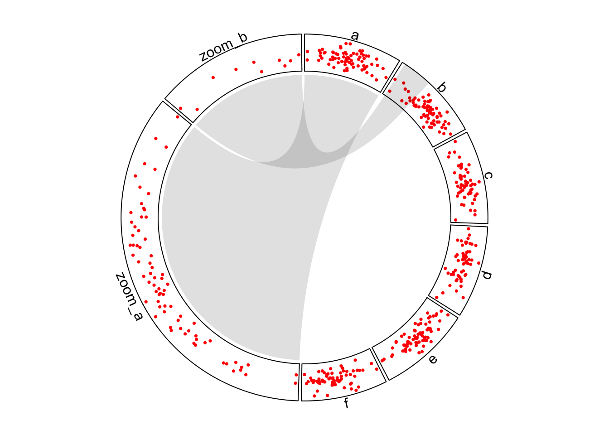
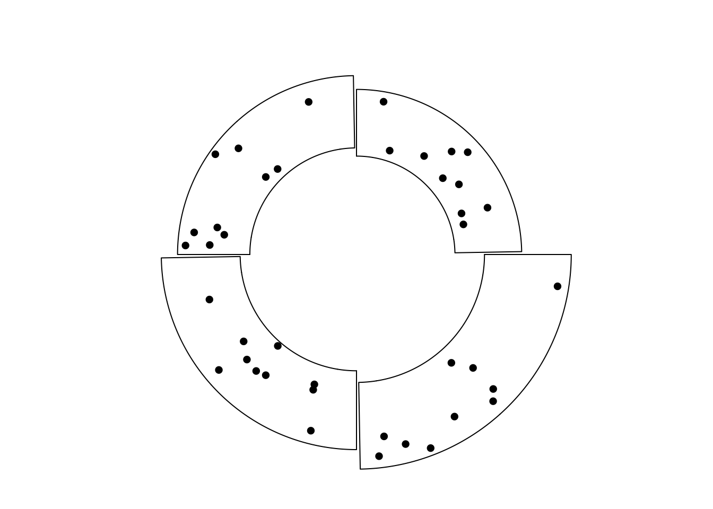

# Advanced layout

## Zooming of sectors

```r
set.seed(123)
df = data.frame(
    sectors = sample(letters[1:6], 400, replace = TRUE),
    x = rnorm(400),
    y = rnorm(400),
    stringsAsFactors = FALSE
)
```

```r
zoom_df_a = df[df$sectors == "a", ]
zoom_df_b = df[df$sectors == "b", ]
zoom_df_b = zoom_df_b[order(zoom_df_b[, 2])[1:10], ]
zoom_df = rbind(zoom_df_a, zoom_df_b)
```

```r
zoom_df$sectors = paste0("zoom_", zoom_df$sectors)
df2 = rbind(df, zoom_df)
```

```r
xrange = tapply(df2$x, df2$sectors, function(x) max(x) - min(x))
normal_sector_index = unique(df$sectors)
zoomed_sector_index = unique(zoom_df$sectors)
sector.width = c(xrange[normal_sector_index] / sum(xrange[normal_sector_index]), 
                 xrange[zoomed_sector_index] / sum(xrange[zoomed_sector_index]))
sector.width
```


```r
par1 = ccPar(start.degree = 90, points.overflow.warning = FALSE)
cc = ccPlot(sectors = df2$sectors, x = df2$x, sector.width = sector.width)
t1 = ccTrack(sectors = df2$sectors, x = df2$x, y = df2$y, 
    panel.fun = function(x, y) {
    circos.points(x, y, col = "red", pch = 16, cex = 0.5)
    circos.text(CELL_META$xcenter, CELL_META$cell.ylim[2] + mm_y(2), 
        CELL_META$sector.index, niceFacing = TRUE)
})
```

```r
l1 = ccLink("a", get.cell.meta.data("cell.xlim", sector.index = "a"),
    "zoom_a", get.cell.meta.data("cell.xlim", sector.index = "zoom_a"),
    border = NA, col = "#00000020")
l2 = ccLink("b", c(zoom_df_b[1, 2], zoom_df_b[10, 2]),
    "zoom_b", get.cell.meta.data("cell.xlim", sector.index = "zoom_b"),
    rou1 = get.cell.meta.data("cell.top.radius", sector.index = "b"),
    border = NA, col = "#00000020")
cc + par1 + t1 + l1 + l2
circos.clear()
```

<div class="figure" style="text-align: center">

<p class="caption">Zoom sectors.</p>
</div>


## Visualize part of the circle 

```r
sectors = letters[1:4]
cc = ccPlot(sectors = sectors, xlim = c(0, 1))

# directly specify the subset of data
df = data.frame(sectors = rep("a", 100),
                x = runif(100),
                y = runif(100))
t1 = ccTrack(df$sectors, x = df$x, y = df$y, 
    panel.fun = function(x, y) {
        circos.points(x, y, pch = 16, cex = 0.5)
})

# create empty track first then fill graphics in the cell
t2 = ccTrack(ylim = range(df$y), bg.border = NA)
cc + t1 + t2
circos.update(sector.index = "a", bg.border = "black")
circos.points(df$x, df$y, pch = 16, cex = 0.5)

circos.track(sectors = sectors, ylim = c(0, 1))
circos.track(sectors = sectors, ylim = c(0, 1))
```

<div class="figure" style="text-align: center">

<p class="caption">(\#fig:circlize-part2)Show subset of cells in tracks.</p>
</div>

```r
circos.clear()
```

## Combine multiple circular plots

```r
sectors = letters[1:4]
cc = ccPlot(sectors = sectors, xlim = c(0, 1))
t1 = ccTrack(ylim = c(0, 1), panel.fun = function(x, y) {
    circos.text(0.5, 0.5, "outer circos", niceFacing = TRUE)
})
cc + t1
circos.clear()

par(new = TRUE) # <- magic
par1 = ccPar("canvas.xlim" = c(-2, 2), "canvas.ylim" = c(-2, 2))
sectors = letters[1:3]
cc = ccPlot(sectors = sectors, xlim = c(0, 1))
t1 = ccTrack(ylim = c(0, 1), panel.fun = function(x, y) {
    circos.text(0.5, 0.5, "inner circos", niceFacing = TRUE)
})
cc + t1
circos.clear()
```

<div class="figure" style="text-align: center">

<p class="caption">Nested circular plots.</p>
</div>

```r
sectors = letters[1:4]
lim = c(1, 1.1, 1.2, 1.3)
for(i in 1:4) {
    par1 = ccPar("canvas.xlim" = c(-lim[i], lim[i]), 
        "canvas.ylim" = c(-lim[i], lim[i]), 
        "track.height" = 0.4)
    cc = ccPlot(sectors = sectors, xlim = c(0, 1))
    t1 = ccTrack(ylim = c(0, 1), bg.border = NA)
    show(cc + par1 + t1)
    circos.update(sector.index = sectors[i], bg.border = "black")
    circos.points(runif(10), runif(10), pch = 16)
    circos.clear()
    par(new = TRUE)
}
par(new = FALSE)
```

<div class="figure" style="text-align: center">

<p class="caption">Cells with differnet radius.</p>
</div>

## Arrange multiple plots

```r
layout(matrix(1:9, 3, 3))
for(i in 1:9) {
    sectors = 1:8
    par(mar = c(0.5, 0.5, 0.5, 0.5))
    par1 = ccPar(cell.padding = c(0, 0, 0, 0))
    cc = ccPlot(sectors = sectors, xlim = c(0, 1))
    t1 = ccTrack(ylim = c(0, 1), track.height = 0.05,
        bg.col = rand_color(8), bg.border = NA)
    cc = cc + par1 + t1
    for(i in 1:20) {
        se = sample(1:8, 2)
        l = ccLink(se[1], runif(2), se[2], runif(2), 
            col = rand_color(1, transparency = 0.4), border = NA)
        cc = cc + l
    }
    show(cc)
    circos.clear()
}
```

<div class="figure" style="text-align: center">

<p class="caption">Arrange multiple circular plots.</p>
</div>

