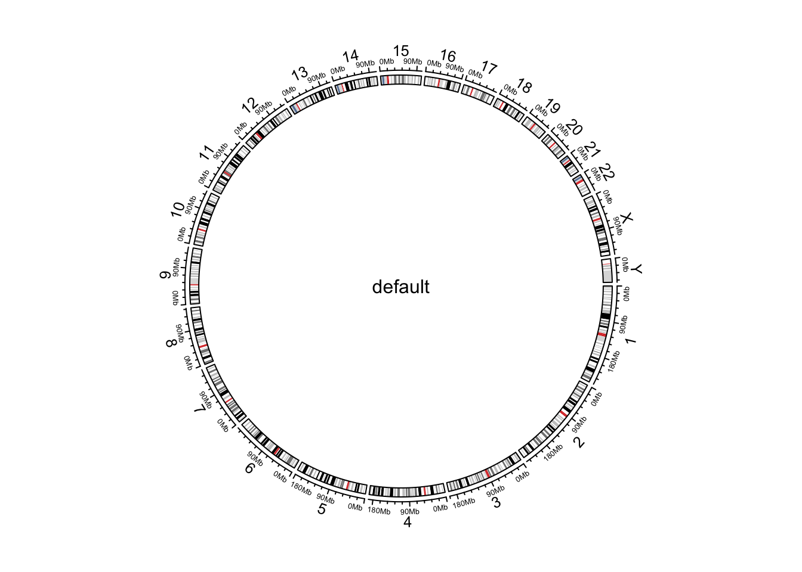
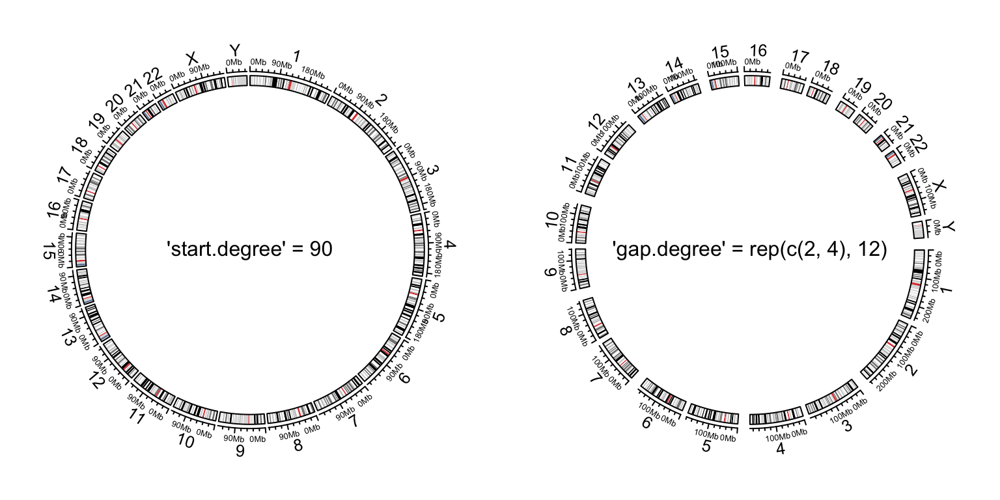
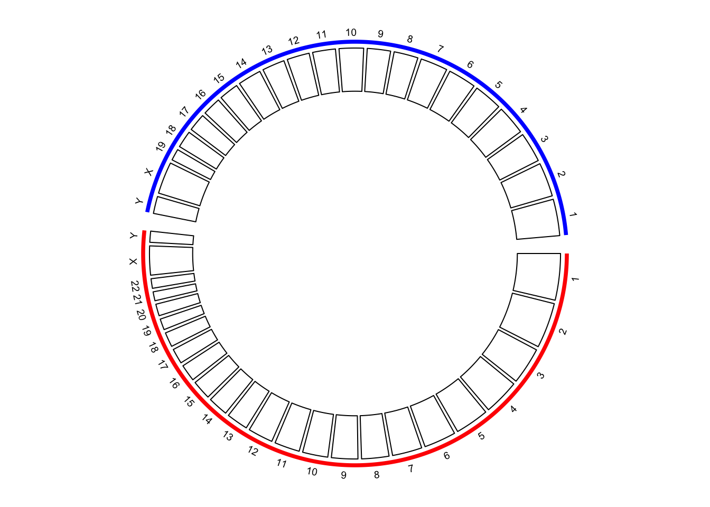

# Initialize with genomic data

**circlize** is quite flexible to initialize the circular plot
not only by chromosomes, but also by any type of general genomic categories.

## Initialize with cytoband data

### Basic usage

```r
ccPlot(initFunc='initializeWithIdeogram')
text(0, 0, "default", cex = 1)
```

<div class="figure" style="text-align: center">

<p class="caption">Initialize genomic plot, default.</p>
</div>

```r
cytoband.file = system.file(package = "circlize", "extdata", "cytoBand.txt")
cc = ccPlot(initFunc='initializeWithIdeogram', cytoband  = cytoband.file)
cc

cytoband.df = read.table(cytoband.file, colClasses = c("character", "numeric",
    "numeric", "character", "character"), sep = "\t")
cc = ccPlot(initFunc='initializeWithIdeogram', cytoband  = cytoband.df)
cc
```

```r
cc = ccPlot(initFunc='initializeWithIdeogram', chromosome.index = paste0("chr", c(3,5,2,8)))
cc
text(0, 0, "subset of chromosomes", cex = 1)
```

<div class="figure" style="text-align: center">

<p class="caption">Initialize genomic plot, subset chromosomes.</p>
</div>

```r
circos.clear()
```

### Pre-defined tracks

```r
cc = ccPlot(initFunc='initializeWithIdeogram', plotType = c("axis", "labels"))
cc
text(0, 0, "plotType = c('axis', 'labels')", cex = 1)
circos.clear()

cc = ccPlot(initFunc='initializeWithIdeogram', plotType = NULL)
cc
text(0, 0, "plotType = NULL", cex = 1)
```

<div class="figure" style="text-align: center">

<p class="caption">Initialize genomic plot, control tracks.</p>
</div>

```r
circos.clear()
```

### Other general settings

```r
par1 = ccPar("start.degree" = 90)
cc = ccPlot(initFunc='initializeWithIdeogram')
cc + par1
circos.clear()
text(0, 0, "'start.degree' = 90", cex = 1)

par1 = ccPar("gap.degree" = rep(c(2, 4), 12))
cc = ccPlot(initFunc='initializeWithIdeogram')
cc + par1
circos.clear()
text(0, 0, "'gap.degree' = rep(c(2, 4), 12)", cex = 1)
```

<div class="figure" style="text-align: center">

<p class="caption">Initialize genomic plot, control layout.</p>
</div>

## Customize chromosome track

```r
set.seed(123)
cc = ccPlot(initFunc='initializeWithIdeogram', plotType = NULL)
t1 = ccTrack(ylim = c(0, 1), panel.fun = function(x, y) {
    chr = CELL_META$sector.index
    xlim = CELL_META$xlim
    ylim = CELL_META$ylim
    circos.rect(xlim[1], 0, xlim[2], 1, col = rand_color(1))
    circos.text(mean(xlim), mean(ylim), chr, cex = 0.7, col = "white",
        facing = "inside", niceFacing = TRUE)
}, track.height = 0.15, bg.border = NA)
cc + t1
```

<div class="figure" style="text-align: center">

<p class="caption">Customize chromosome track.</p>
</div>

```r
circos.clear()
```

## Initialize with general genomic category

```r
tp_family = readRDS(system.file(package = "circlize", "extdata", "tp_family_df.rds"))
head(tp_family)
```
```r
cc = ccPlot(initFunc = 'initializeWithIdeogram', cytoband = tp_family)
t1 = ccTrack(ylim = c(0, 1), 
    bg.col = c("#FF000040", "#00FF0040", "#0000FF40"), 
    bg.border = NA, track.height = 0.05)
```

```r
n = max(tapply(tp_family$transcript, tp_family$gene, function(x) length(unique(x))))
t2 = ccGenomicTrack(data = tp_family, ylim = c(0.5, n + 0.5), 
    panel.fun = function(region, value, ...) {
        all_tx = unique(value$transcript)
        for(i in seq_along(all_tx)) {
            l = value$transcript == all_tx[i]
            # for each transcript
            current_tx_start = min(region[l, 1])
            current_tx_end = max(region[l, 2])
            circos.lines(c(current_tx_start, current_tx_end), 
                c(n - i + 1, n - i + 1), col = "#CCCCCC")
            circos.genomicRect(region[l, , drop = FALSE], ytop = n - i + 1 + 0.4, 
                ybottom = n - i + 1 - 0.4, col = "orange", border = NA)
        }
}, bg.border = NA, track.height = 0.4)
cc + t1 + t2
circos.clear()
```

<div class="figure" style="text-align: center">

<p class="caption">Circular representation of alternative transcripts for genes.</p>
</div>


## Zooming chromosomes

```r
extend_chromosomes = function(bed, chromosome, prefix = "zoom_") {
    zoom_bed = bed[bed[[1]] %in% chromosome, , drop = FALSE]
    zoom_bed[[1]] = paste0(prefix, zoom_bed[[1]])
    rbind(bed, zoom_bed)
}
```

```r
cytoband = read.cytoband()
cytoband_df = cytoband$df
chromosome = cytoband$chromosome

xrange = c(cytoband$chr.len, cytoband$chr.len[c("chr1", "chr2")])
normal_chr_index = 1:24
zoomed_chr_index = 25:26

# normalize in normal chromsomes and zoomed chromosomes separately
sector.width = c(xrange[normal_chr_index] / sum(xrange[normal_chr_index]), 
                 xrange[zoomed_chr_index] / sum(xrange[zoomed_chr_index])) 
```

```r
par1 = ccPar(start.degree = 90)
cc = ccPlot(initFunc = 'initializeWithIdeogram', cytoband = extend_chromosomes(cytoband_df, c("chr1", "chr2")), 
    sector.width = sector.width)
```


```r
bed = generateRandomBed(500)
t1 = ccGenomicTrack(extend_chromosomes(bed, c("chr1", "chr2")),
    panel.fun = function(region, value, ...) {
        circos.genomicPoints(region, value, pch = 16, cex = 0.3)
})
cc + par1 + t1
```

```r
circos.link("chr1", get.cell.meta.data("cell.xlim", sector.index = "chr1"),
    "zoom_chr1", get.cell.meta.data("cell.xlim", sector.index = "zoom_chr1"),
    col = "#00000020", border = NA)

circos.clear()
```

<div class="figure" style="text-align: center">

<p class="caption">Zoom chromosomes.</p>
</div>

## Concatenating two genomes

```r
human_cytoband = read.cytoband(species = "hg19")$df
mouse_cytoband = read.cytoband(species = "mm10")$df
```

```r
human_cytoband[ ,1] = paste0("human_", human_cytoband[, 1])
mouse_cytoband[ ,1] = paste0("mouse_", mouse_cytoband[, 1])
```

```r
cytoband = rbind(human_cytoband, mouse_cytoband)
head(cytoband)
```

```r
chromosome.index = c(paste0("human_chr", c(1:22, "X", "Y")), 
                     rev(paste0("mouse_chr", c(1:19, "X", "Y"))))
ccPlot(initFunc = "initializeWithIdeogram", cytoband = cytoband, chromosome.index = chromosome.index)
```

<div class="figure" style="text-align: center">

<p class="caption">Default style of two combined genomes.</p>
</div>

```r
circos.clear()
```

```r
par1 = ccPar(gap.after = c(rep(1, 23), 5, rep(1, 20), 5))
cc = ccPlot(initFunc = "initializeWithIdeogram", cytoband = cytoband, plotType = NULL, 
    chromosome.index = chromosome.index)
t1 = ccTrack(ylim = c(0, 1), panel.fun = function(x, y) {
    circos.text(CELL_META$xcenter, CELL_META$ylim[2] + mm_y(2), 
        gsub(".*chr", "", CELL_META$sector.index), cex = 0.6, niceFacing = TRUE)
}, track.height = mm_h(1), cell.padding = c(0, 0, 0, 0), bg.border = NA)
t2 = ccGenomicIdeogram(cytoband)
cc + par1 + t1 + t2
highlight.chromosome(paste0("human_chr", c(1:22, "X", "Y")), 
    col = "red", track.index = 1)
highlight.chromosome(paste0("mouse_chr", c(1:19, "X", "Y")), 
    col = "blue", track.index = 1)
```

<div class="figure" style="text-align: center">

<p class="caption">(\#fig:genomic-combined-improved)Improved visualization of the combined genome.</p>
</div>

```r
circos.clear()
```


```r
human_chromInfo = read.chromInfo(species = "hg19")$df
mouse_chromInfo = read.chromInfo(species = "mm10")$df
human_chromInfo[ ,1] = paste0("human_", human_chromInfo[, 1])
mouse_chromInfo[ ,1] = paste0("mouse_", mouse_chromInfo[, 1])
chromInfo = rbind(human_chromInfo, mouse_chromInfo)
# note the levels of the factor controls the chromosome orders in the plot
chromInfo[, 1] = factor(chromInfo[ ,1], levels = chromosome.index)
head(chromInfo)
```

```r
par1 = ccPar(gap.after = c(rep(1, 23), 5, rep(1, 20), 5))
cc = ccPlot(initFunc = "genomicInitialize", data = chromInfo, plotType = NULL)
t1 = ccTrack(ylim = c(0, 1), panel.fun = function(x, y) {
    circos.text(CELL_META$xcenter, CELL_META$ylim[2] + mm_y(2), 
        gsub(".*chr", "", CELL_META$sector.index), cex = 0.6, niceFacing = TRUE)
}, track.height = mm_h(1), cell.padding = c(0, 0, 0, 0), bg.border = NA)
t2 = ccTrack(ylim = c(0, 1))
cc + par1 + t1 + t2
highlight.chromosome(paste0("human_chr", c(1:22, "X", "Y")), 
    col = "red", track.index = 1)
highlight.chromosome(paste0("mouse_chr", c(1:19, "X", "Y")), 
    col = "blue", track.index = 1)
```

<div class="figure" style="text-align: center">

<p class="caption">Initialize the plot with chromosome ranges.</p>
</div>

```r
circos.clear()
```

```r
par1 = ccPar(gap.after = c(rep(1, 23), 5, rep(1, 20), 5))
cc = ccPlot(initFunc = "genomicInitialize", data = chromInfo, plotType = NULL)
t1 = ccTrack(ylim = c(0, 1), panel.fun = function(x, y) {
    circos.text(CELL_META$xcenter, CELL_META$ylim[2] + mm_y(2), 
        gsub(".*chr", "", CELL_META$sector.index), cex = 0.6, niceFacing = TRUE)
}, track.height = mm_h(1), cell.padding = c(0, 0, 0, 0), bg.border = NA)
t2 = ccGenomicIdeogram(cytoband = cytoband)
highlight.chromosome(paste0("human_chr", c(1:22, "X", "Y")), 
    col = "red", track.index = 1)
highlight.chromosome(paste0("mouse_chr", c(1:19, "X", "Y")), 
    col = "blue", track.index = 1)

# a track of points
human_df = generateRandomBed(200, species = "hg19")
mouse_df = generateRandomBed(200, species = "mm10")
human_df[ ,1] = paste0("human_", human_df[, 1])
mouse_df[ ,1] = paste0("mouse_", mouse_df[, 1])
df = rbind(human_df, mouse_df)
t3 = ccGenomicTrack(df, panel.fun = function(region, value, ...) {
    circos.genomicPoints(region, value, col = rand_color(1), cex = 0.5, ...)
})

# links between human and mouse genomes
human_mid = data.frame(
    chr = paste0("human_chr", 1:19),
    mid = round((human_chromInfo[1:19, 2] + human_chromInfo[1:19, 3])/2)
)
mouse_mid = data.frame(
    chr = paste0("mouse_chr", 1:19),
    mid = round((mouse_chromInfo[1:19, 2] + mouse_chromInfo[1:19, 3])/2)
)
l1 = ccGenomicLink(human_mid, mouse_mid, col = rand_color(19))
cc + par1 + t1 + t2 + t3 + l1
circos.clear()
text(-0.9, -0.8, "Human\ngenome")
text(0.9, 0.8, "Mouse\ngenome")
```

<div class="figure" style="text-align: center">

<p class="caption">The combined genome with more tracks.</p>
</div>
