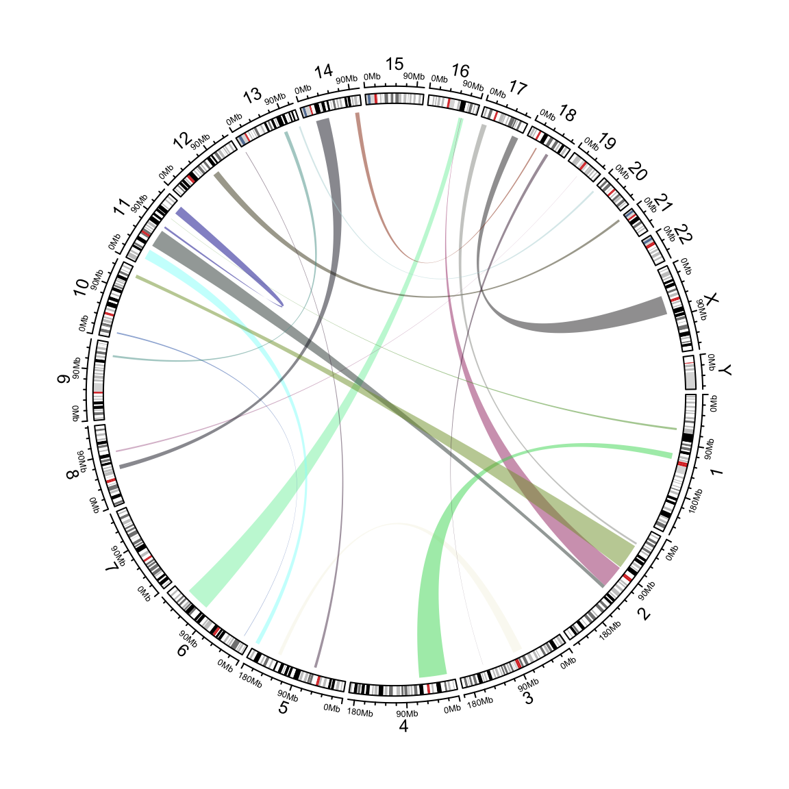

# Create plotting regions for genomic data 

## Links 

```r
set.seed(123)
bed1 = generateRandomBed(nr = 100)
bed1 = bed1[sample(nrow(bed1), 20), ]
bed2 = generateRandomBed(nr = 100)
bed2 = bed2[sample(nrow(bed2), 20), ]

cc = ccPlot(initFunc = "initializeWithIdeogram")
l1 =ccGenomicLink(bed1, bed2, col = rand_color(nrow(bed1), transparency = 0.5), border = NA)
cc + l1
```

<div class="figure" style="text-align: center">

<p class="caption">Add links from two sets of genomic regions.</p>
</div>

```r
circos.clear()
```