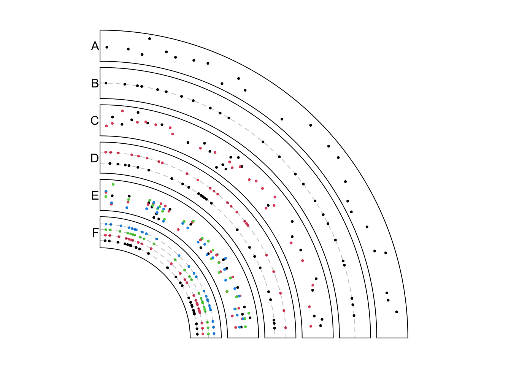
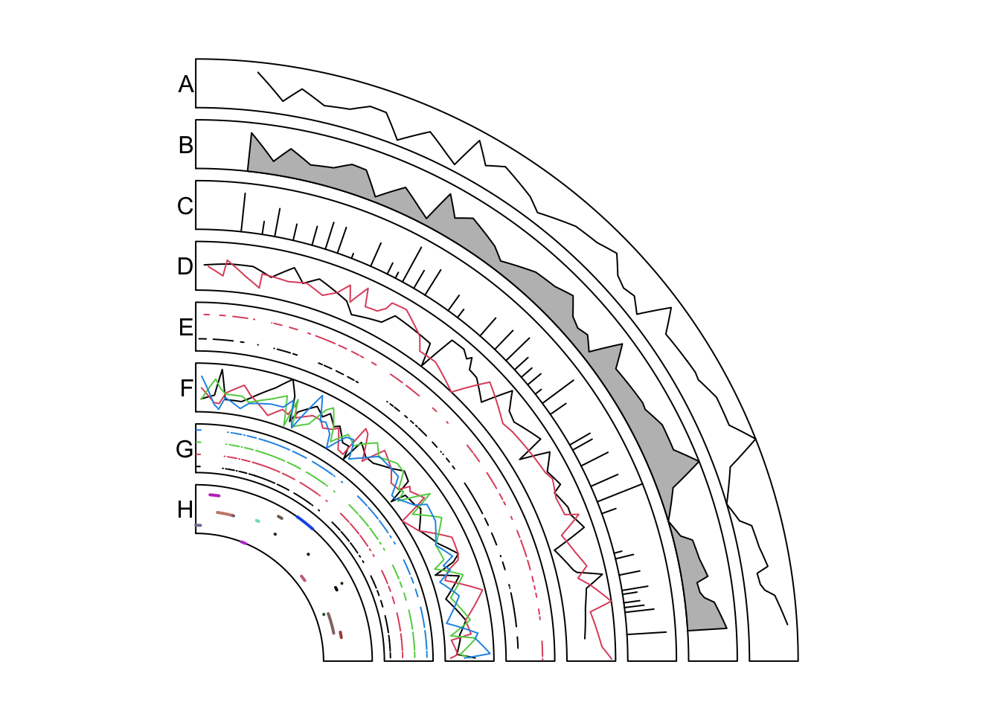
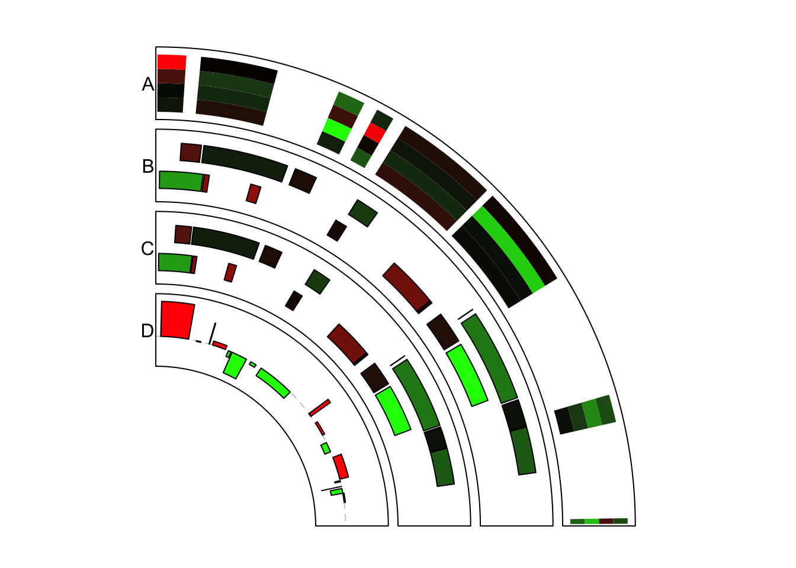

# Modes for `circos.genomicTrack()` 

## Applications


### Points


```r
set.seed(999)
par1 = ccPar("track.height" = 0.1, start.degree = 90,
    canvas.xlim = c(0, 1), canvas.ylim = c(0, 1), gap.degree = 270)
cc = ccPlot(initFunc = "initializeWithIdeogram",chromosome.index = "chr1", plotType = NULL)
```

```r
bed = generateRandomBed(nr = 300)
t1 = ccGenomicTrack(bed, panel.fun = function(region, value, ...) {
    circos.genomicPoints(region, value, pch = 16, cex = 0.5, ...)
})
```

```r
t2 = ccGenomicTrack(bed, stack = TRUE, 
    panel.fun = function(region, value, ...) {
        circos.genomicPoints(region, value, pch = 16, cex = 0.5,...)
        i = getI(...)
        circos.lines(CELL_META$cell.xlim, c(i, i), lty = 2, col = "#00000040")
})
```

```r
bed1 = generateRandomBed(nr = 300)
bed2 = generateRandomBed(nr = 300)
bed_list = list(bed1, bed2)
t3 = ccGenomicTrack(bed_list, 
    panel.fun = function(region, value, ...) {
        i = getI(...)
        circos.genomicPoints(region, value, pch = 16, cex = 0.5, col = i, ...)
})
```

```r
t4 = ccGenomicTrack(bed_list, stack = TRUE, 
    panel.fun = function(region, value, ...) {
        i = getI(...)
        circos.genomicPoints(region, value, pch = 16, cex = 0.5, col = i, ...)
        circos.lines(CELL_META$cell.xlim, c(i, i), lty = 2, col = "#00000040")
})
```


```r
bed = generateRandomBed(nr = 300, nc = 4)
t5 = ccGenomicTrack(bed, 
    panel.fun = function(region, value, ...) {
        circos.genomicPoints(region, value, pch = 16, cex = 0.5, col = 1:4, ...)
})
```


```r
bed = generateRandomBed(nr = 300, nc = 4)
t6 = ccGenomicTrack(bed, stack = TRUE, 
    panel.fun = function(region, value, ...) {
        i = getI(...)
        circos.genomicPoints(region, value, pch = 16, cex = 0.5, col = i, ...)
        circos.lines(CELL_META$cell.xlim, c(i, i), lty = 2, col = "#00000040")
})

cc + par1 + t1 + t2 + t3 + t4 + t5 + t6
circos.clear()
```

<div class="figure" style="text-align: center">

<p class="caption">Add points under different modes.</p>
</div>

### Lines

```r
par1 = ccPar("track.height" = 0.08, start.degree = 90,
    canvas.xlim = c(0, 1), canvas.ylim = c(0, 1), gap.degree = 270,
    cell.padding = c(0, 0, 0, 0))
cc = ccPlot(initFunc = "initializeWithIdeogram", chromosome.index = "chr1", plotType = NULL)
```

```r
bed = generateRandomBed(nr = 500)
t1 =ccGenomicTrack(bed, 
    panel.fun = function(region, value, ...) {
        circos.genomicLines(region, value)
})
```

```r
t2 =ccGenomicTrack(bed, 
    panel.fun = function(region, value, ...) {
        circos.genomicLines(region, value, area = TRUE)
})
t3 =ccGenomicTrack(bed, 
    panel.fun = function(region, value, ...) {
        circos.genomicLines(region, value, type = "h")
})
```

```r
bed1 = generateRandomBed(nr = 500)
bed2 = generateRandomBed(nr = 500)
bed_list = list(bed1, bed2)
t4 =ccGenomicTrack(bed_list, 
    panel.fun = function(region, value, ...) {
        i = getI(...)
        circos.genomicLines(region, value, col = i, ...)
})
```

```r
t5 =ccGenomicTrack(bed_list, stack = TRUE, 
    panel.fun = function(region, value, ...) {
        i = getI(...)
        circos.genomicLines(region, value, col = i, ...)
})
```

```r
bed = generateRandomBed(nr = 500, nc = 4)
t6 =ccGenomicTrack(bed, 
    panel.fun = function(region, value, ...) {
        circos.genomicLines(region, value, col = 1:4, ...)
})
```

```r
bed = generateRandomBed(nr = 500, nc = 4)
t7 =ccGenomicTrack(bed, stack = TRUE, 
    panel.fun = function(region, value, ...) {
        i = getI(...)
        circos.genomicLines(region, value, col = i, ...)
})
```

```r
bed = generateRandomBed(nr = 200)
t8 =ccGenomicTrack(bed, 
    panel.fun = function(region, value, ...) {
        circos.genomicLines(region, value, type = "segment", lwd = 2, 
            col = rand_color(nrow(region)), ...)
})

cc +  par1 + t1 + t2 + t3 + t4 + t5 + t6 + t7 + t8
circos.clear()
```

<div class="figure" style="text-align: center">

<p class="caption">Add lines under different modes.</p>
</div>

### Rectangles

```r
par1 = ccPar("track.height" = 0.15, start.degree = 90,
    canvas.xlim = c(0, 1), canvas.ylim = c(0, 1), gap.degree = 270)
cc = ccPlot(initFunc = "initializeWithIdeogram", chromosome.index = "chr1", plotType = NULL)
col_fun = colorRamp2(breaks = c(-1, 0, 1), colors = c("green", "black", "red"))
```

```r
bed = generateRandomBed(nr = 100, nc = 4)
t1 = ccGenomicTrack(bed, stack = TRUE, 
    panel.fun = function(region, value, ...) {
        circos.genomicRect(region, value, col = col_fun(value[[1]]), border = NA, ...)
})
```

```r
bed1 = generateRandomBed(nr = 100)
bed2 = generateRandomBed(nr = 100)
bed_list = list(bed1, bed2)
t2 = ccGenomicTrack(bed_list, stack = TRUE, 
    panel.fun = function(region, value, ...) {
        i = getI(...)
        circos.genomicRect(region, value, ytop = i + 0.3, ybottom = i - 0.3,
            col = col_fun(value[[1]]), ...)
})
```

```r
t3 = ccGenomicTrack(bed_list, ylim = c(0.5, 2.5), 
    panel.fun = function(region, value, ...) {
        i = getI(...)
        circos.genomicRect(region, value, ytop = i + 0.3, ybottom = i - 0.3, 
            col = col_fun(value[[1]]), ...)
})
```

```r
bed = generateRandomBed(nr = 200)
t4 = ccGenomicTrack(bed, 
    panel.fun = function(region, value, ...) {
        circos.genomicRect(region, value, ytop.column = 1, ybottom = 0, 
            col = ifelse(value[[1]] > 0, "red", "green"), ...)
        circos.lines(CELL_META$cell.xlim, c(0, 0), lty = 2, col = "#00000040")
})

cc + par1 + t1 + t2 + t3 + t4
circos.clear()
```

<div class="figure" style="text-align: center">

<p class="caption">Add rectangles under different modes.</p>
</div>
