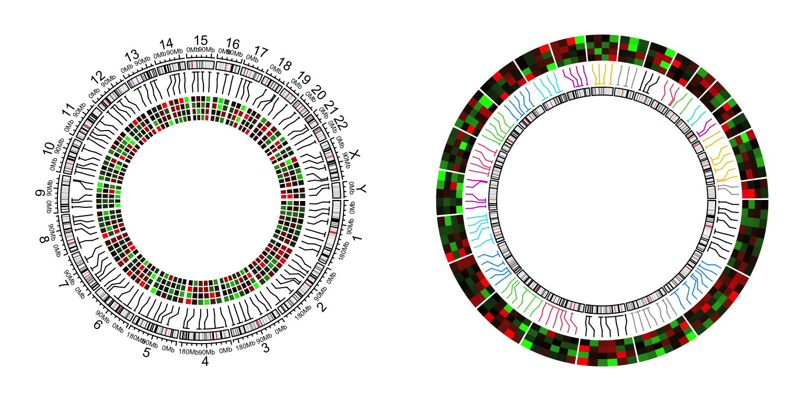
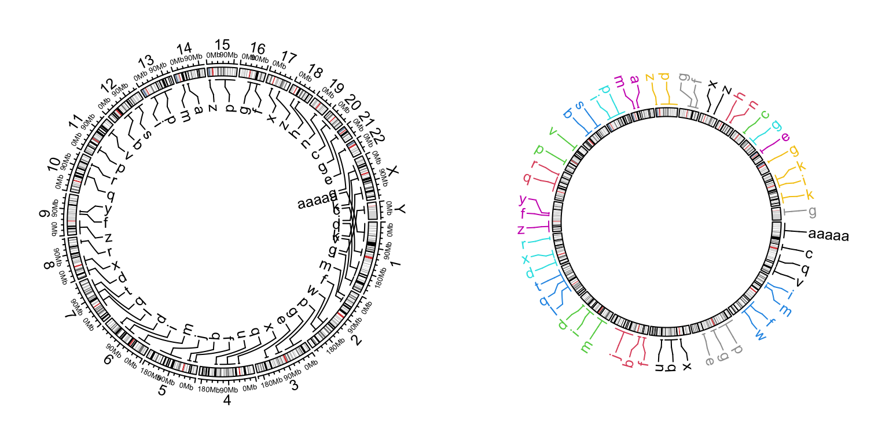
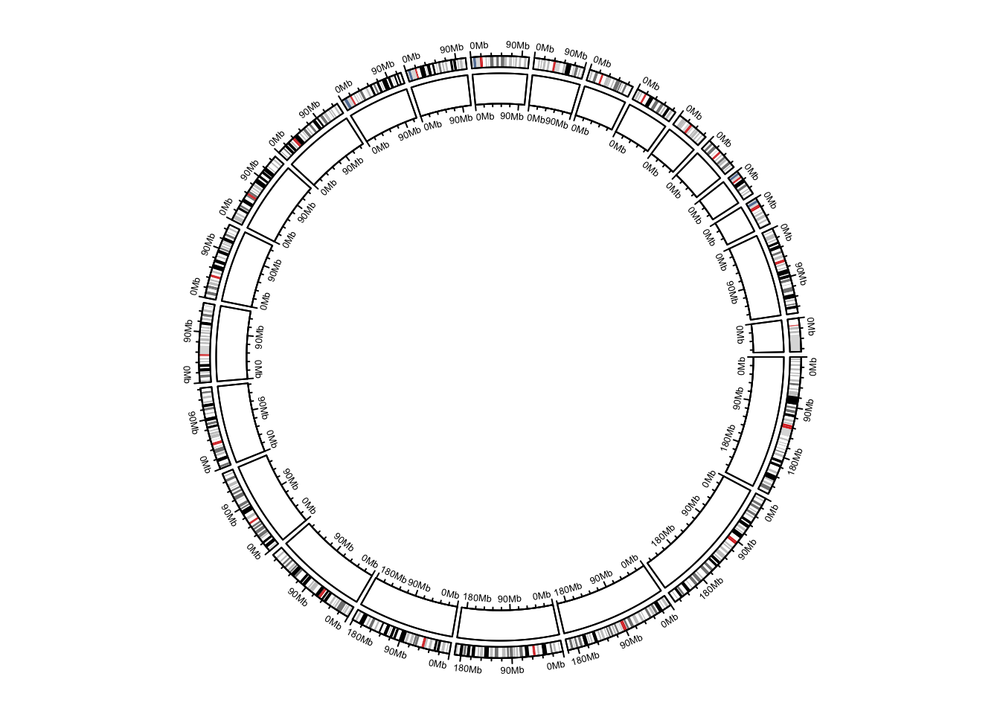
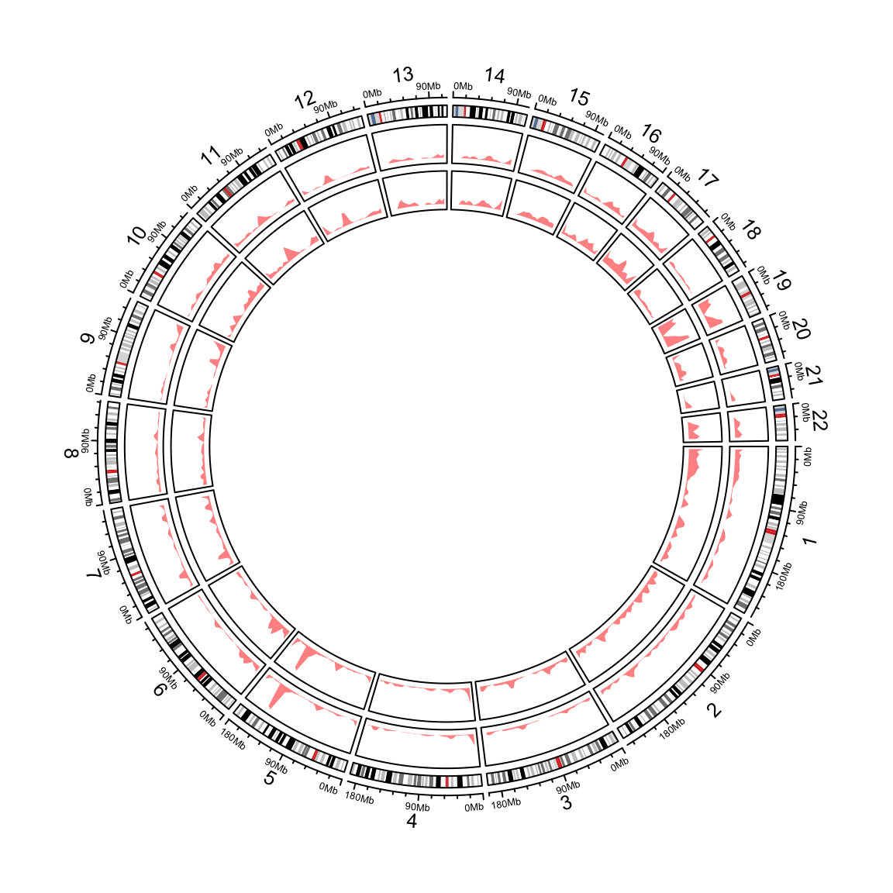

# High-level genomic functions


## Ideograms

```r
cc = ccPlot(initFunc = "initializeWithIdeogram", plotType = c("labels", "axis"))
t1 = ccTrack(ylim = c(0, 1))
t2 =ccGenomicIdeogram() # put ideogram as the third track
t3 = ccGenomicIdeogram(track.height = 0.2)
cc + t1 + t2 + t3
```

<div class="figure" style="text-align: center">

<p class="caption">Circular ideograms.</p>
</div>

## Heatmaps


```r
cc = ccPlot(initFunc = "initializeWithIdeogram")
bed = generateRandomBed(nr = 100, nc = 4)
col_fun = colorRamp2(c(-1, 0, 1), c("green", "black", "red"))
t1 = ccGenomicHeatmap(bed, col = col_fun, side = "inside", border = "white")
cc + t1
circos.clear()
```


```r
cc = ccPlot(initFunc = "initializeWithIdeogram", plotType = NULL)
t1 = ccGenomicHeatmap(bed, col = col_fun, side = "outside",
    line_col = as.numeric(factor(bed[[1]])))
t2 = ccGenomicIdeogram()
cc + t1 + t2
circos.clear()
```

<div class="figure" style="text-align: center">

<p class="caption">Genomic heamtaps.</p>
</div>

## Labels

```r
cc = ccPlot(initFunc = "initializeWithIdeogram")
bed = generateRandomBed(nr = 50, fun = function(k) sample(letters, k, replace = TRUE))
bed[1, 4] = "aaaaa"
t1 = ccGenomicLabels(bed, labels.column = 4, side = "inside")
cc + t1
circos.clear()
```

```r
cc = ccPlot(initFunc = "initializeWithIdeogram", plotType = NULL)
t1 = ccGenomicLabels(bed, labels.column = 4, side = "outside",
	col = as.numeric(factor(bed[[1]])), line_col = as.numeric(factor(bed[[1]])))
t2 = ccGenomicIdeogram()
cc + t1 + t2
circos.clear()
```

<div class="figure" style="text-align: center">

<p class="caption">Genomic labels.</p>
</div>

## Genomic axes

```r
cc = ccPlot(initFunc = "initializeWithIdeogram", plotType = c("axis"))
t1 = ccGenomicIdeogram()
t2 = ccTrack(ylim = c(0, 1), track.height = 0.1, panel.fun = function(x, y) {
	circos.genomicAxis(h = "bottom", direction = "inside")
})
cc + t1 + t2
```

<div class="figure" style="text-align: center">

<p class="caption">Add genomic axes.</p>
</div>

```r
circos.clear()
```

## Genomic density and Rainfall plot

```r
load(system.file(package = "circlize", "extdata", "DMR.RData"))
cc = ccPlot(initFunc="initializeWithIdeogram", chromosome.index = paste0("chr", 1:22))

bed_list = list(DMR_hyper, DMR_hypo)
t1 = ccGenomicRainfall(bed_list, pch = 16, cex = 0.4, col = c("#FF000080", "#0000FF80"))
t2 = ccGenomicDensity(DMR_hyper, col = c("#FF000080"), track.height = 0.1)
t3 = ccGenomicDensity(DMR_hypo, col = c("#0000FF80"), track.height = 0.1)
cc + t1 + t2 + t3
```

<div class="figure" style="text-align: center">

<p class="caption">Genomic rainfall plot and densities.</p>
</div>

```r
circos.clear()
```

```r
cc = ccPlot(initFunc = "initializeWithIdeogram", chromosome.index = paste0("chr", 1:22))
t1 = ccGenomicDensity(DMR_hyper, col = c("#FF000080"), track.height = 0.1)
t2 = ccGenomicDensity(DMR_hyper, col = c("#FF000080"), count_by = "number", track.height = 0.1)
cc + t1 + t2
```

<div class="figure" style="text-align: center">

<p class="caption">Genomic densities.</p>
</div>

```r
circos.clear()
```