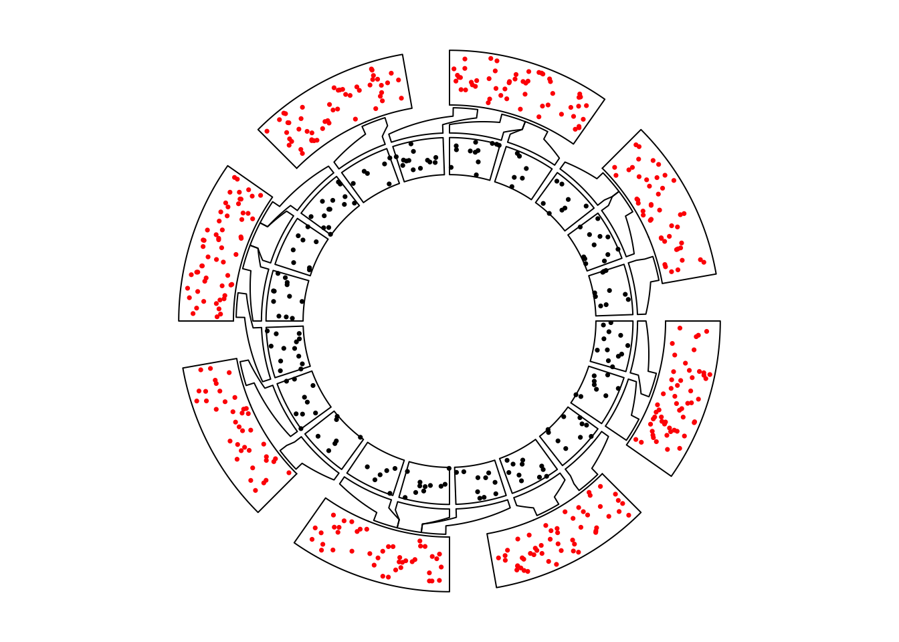
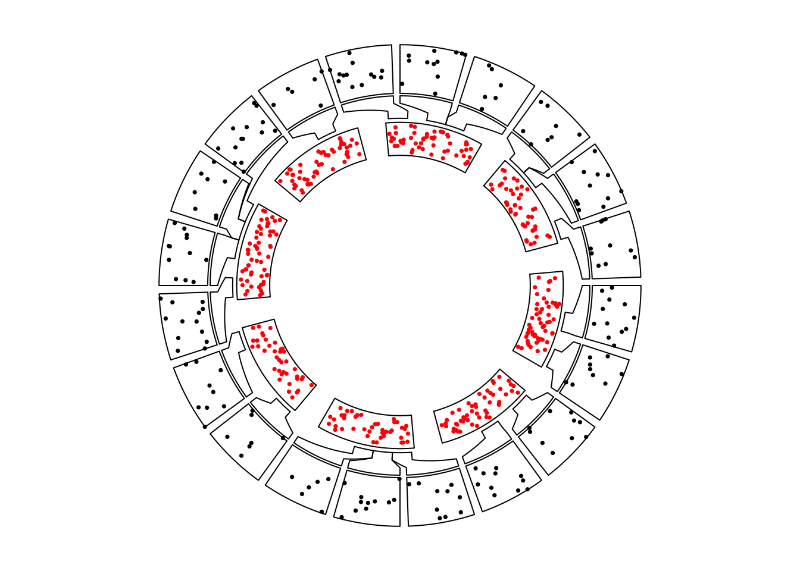
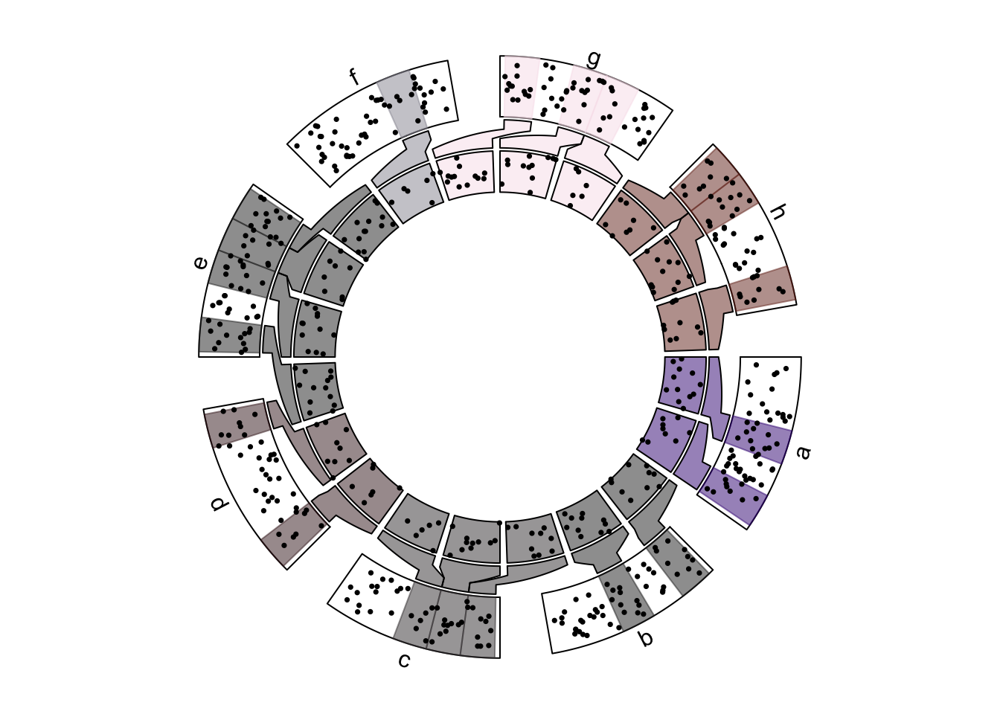
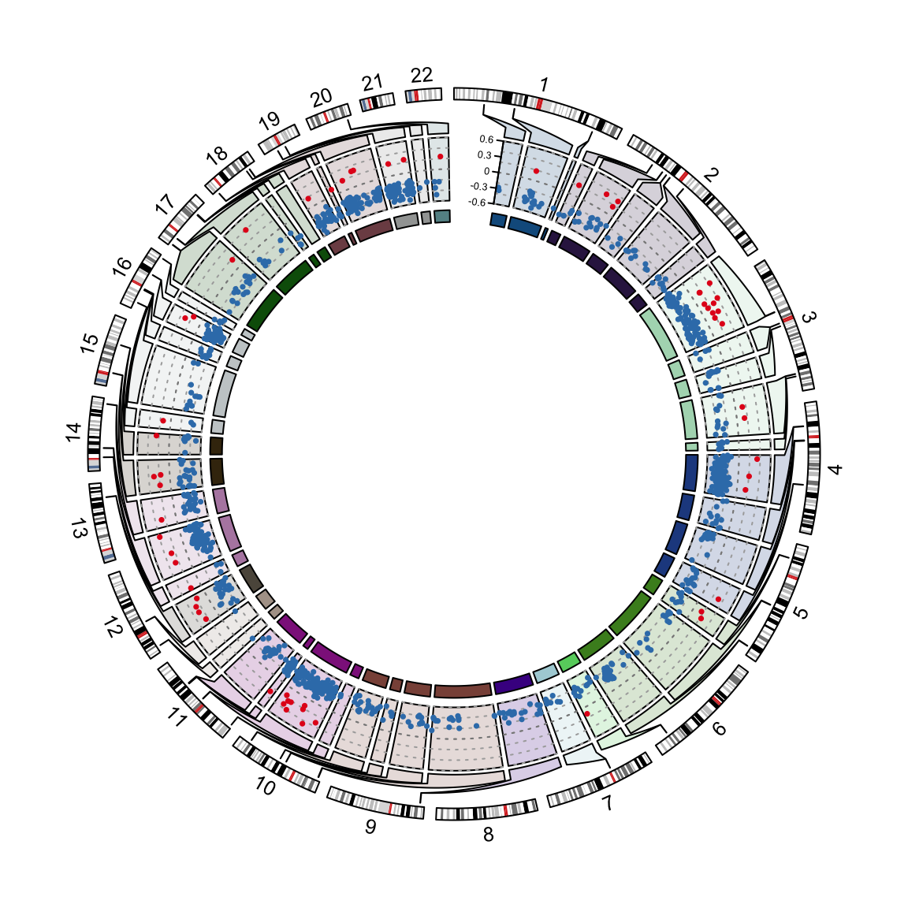

# Nested zooming

## Basic idea

```r
set.seed(123)
df = data.frame(cate = sample(letters[1:8], 400, replace = TRUE),
	            x = runif(400),
	            y = runif(400),
	            stringsAsFactors = FALSE)
df = df[order(df[[1]], df[[2]]), ]
rownames(df) = NULL
df$interval_x = as.character(cut(df$x, c(0, 0.2, 0.4, 0.6, 0.8, 1.0)))
df$name = paste(df$cate, df$interval_x, sep = ":")
df$start = as.numeric(gsub("^\\((\\d(\\.\\d)?).*(\\d(\\.\\d)?)]", "\\1", df$interval_x))
df$end = as.numeric(gsub("^\\((\\d(\\.\\d)?),(\\d(\\.\\d)?)]$", "\\3", df$interval_x))
nm = sample(unique(df$name), 20)
df2 = df[df$name %in% nm, ]

correspondance = unique(df2[, c("cate", "start", "end", "name", "start", "end")])
zoom_sector = unique(df2[, c("name", "start", "end", "cate")])
zoom_data = df2[, c("name", "x", "y")]

data = df[, 1:3]
sector = data.frame(cate = letters[1:8], start = 0, end = 1, stringsAsFactors = FALSE)

sector_col = structure(rand_color(8, transparency = 0.5), names = letters[1:8])
```

```r
circos.clear()
f1 = function() {
	par1 = ccPar(gap.degree = 10)
	cc = ccPlot(sectors = sector[, 1], xlim = sector[, 2:3], clear = FALSE)
	t1 = ccTrack(data[[1]], x = data[[2]], y = data[[3]], ylim = c(0, 1), 
		panel.fun = function(x, y) {
			circos.points(x, y, pch = 16, cex = 0.5, col = "red")
	})
	show(cc + par1 + t1)
}

f2 = function() {
	par1 = ccPar(gap.degree = 2, cell.padding = c(0, 0, 0, 0))
	cc = ccPlot(sectors = zoom_sector[[1]], xlim = as.matrix(zoom_sector[, 2:3]), clear = FALSE)
	t1 = ccTrack(zoom_data[[1]], x = zoom_data[[2]], y = zoom_data[[3]], 
		panel.fun = function(x, y) {
			circos.points(x, y, pch = 16, cex = 0.5)
		})
	show(cc + par1 + t1)
}
```

```r
circos.nested(f1, f2, correspondance)
```

<div class="figure" style="text-align: center">

<p class="caption">Nested zooming between two circular plots.</p>
</div>


```r
circos.nested(f2, f1, correspondance[, c(4:6, 1:3)])
```

<div class="figure" style="text-align: center">

<p class="caption">Nested zooming between two circular plots, zoomed plot is put outside.</p>
</div>


```r
sector_col = structure(rand_color(8, transparency = 0.5), names = letters[1:8])
circos.clear()
f1 = function() {
	par1 = ccPar(gap.degree = 10)
	cc = ccPlot(sectors = sector[, 1], xlim = sector[, 2:3], clear = FALSE)
	t1 = ccTrack(data[[1]], x = data[[2]], y = data[[3]], ylim = c(0, 1), 
		panel.fun = function(x, y) {
			l = correspondance[[1]] == CELL_META$sector.index
			if(sum(l)) {
				for(i in which(l)) {
					circos.rect(correspondance[i, 2], CELL_META$cell.ylim[1],
						        correspondance[i, 3], CELL_META$cell.ylim[2],
						        col = sector_col[CELL_META$sector.index],
						        border = sector_col[CELL_META$sector.index])
				}
			}
			circos.points(x, y, pch = 16, cex = 0.5)
			circos.text(CELL_META$xcenter, CELL_META$ylim[2] + mm_y(2), 
				CELL_META$sector.index, niceFacing = TRUE, adj = c(0.5, 0))
	})
	show(cc + par1 + t1)
}

f2 = function() {
	par1 = ccPar(gap.degree = 2, cell.padding = c(0, 0, 0, 0))
	cc = ccPlot(sectors = zoom_sector[[1]], xlim = as.matrix(zoom_sector[, 2:3]), clear = FALSE)
	t1 = ccTrack(zoom_data[[1]], x = zoom_data[[2]], y = zoom_data[[3]], 
		panel.fun = function(x, y) {
			circos.points(x, y, pch = 16, cex = 0.5)
		}, bg.col = sector_col[zoom_sector$cate],
		track.margin = c(0, 0))
	show(cc + par1 + t1)
	
}
circos.nested(f1, f2, correspondance, connection_col = sector_col[correspondance[[1]]])
```

<div class="figure" style="text-align: center">

<p class="caption">Nested zooming between two circular plots, slightly complex plots.</p>
</div>

## Visualization of DMRs from tagmentation-based WGBS

```r
load(system.file(package = "circlize", "extdata", "tagments_WGBS_DMR.RData"))
```

```r
circos.clear()
chr_bg_color = rand_color(22, transparency = 0.8)
names(chr_bg_color) = paste0("chr", 1:22)

f1 = function() {
	par1 = ccPar(gap.after = 2, start.degree = 90)
	cc = ccPlot(initMode = "initializeWithIdeogram", chromosome.index = paste0("chr", 1:22), 
		plotType = c("ideogram", "labels"), ideogram.height = 0.03, clear = FALSE)
	show(cc + par1)
}

f2 = function() {
	par1 = ccPar(cell.padding = c(0, 0, 0, 0), gap.after = c(rep(1, nrow(tagments)-1), 10))
	cc = ccPlot(initMode = "genomicInitialize",data = tagments, plotType = NULL, clear = FALSE)
	t1 = ccGenomicTrack(DMR1, ylim = c(-0.6, 0.6), 
		panel.fun = function(region, value, ...) {
			for(h in seq(-0.6, 0.6, by = 0.2)) {
		        circos.lines(CELL_META$cell.xlim, c(h, h), lty = 3, col = "#AAAAAA")
		    }
		    circos.lines(CELL_META$cell.xlim, c(0, 0), lty = 3, col = "#888888")
	    
			circos.genomicPoints(region, value, 
				col = ifelse(value[[1]] > 0, "#E41A1C", "#377EB8"), 
				pch = 16, cex = 0.5)
	}, bg.col = chr_bg_color[tagments$chr], track.margin = c(0.02, 0))
	c1 = ccCell(sector.index = "chr1-44876009-45016546")
	y1 = ccYaxis(side = "left", at = seq(-0.6, 0.6, by = 0.3), labels.cex = 0.4)
	t2 = ccTrack(ylim = c(0, 1), track.height = mm_h(2), 
		bg.col = add_transparency(chr_bg_color[tagments$chr], 0))
	c1 = c1 + y1
	t1 = t1 + c1
	show(cc + par1 + t1 + t2)
	
	
}

circos.nested(f1, f2, correspondance, connection_col = chr_bg_color[correspondance[[1]]])
```

<div class="figure" style="text-align: center">

<p class="caption">Visualization of DMRs.</p>
</div>
